[toc]

# 问题

提问者：**<a href="https://www.zhihu.com/people/leo-49-51-22">巇罅</a>**
提问时间: 2016-3-24 23:53:56

突然发现自己变老是怎样一种体验？

# 回答

回答者： **<a href="https://www.zhihu.com/people/feng-shou-ma-ma">Eleven丰收妈妈</a>**
回答时间: 2025-5-29 16:3:44
点赞总数: 1225
评论总数: 36
收藏总数: 697
喜欢总数：128

突然发现自己变老了是从垮脸开始的。工作关系，经常要给孩子们上公开课、给家长、老师们培训，习惯化淡妆。但过了35岁，尤其40岁之后，我发现我的脸垮了，沟沟壑壑增多，脸怎么看都不平坦了。粉底液刚上脸就卡在法令纹里，散粉扑了三层仍盖不住下颌线的模糊阴影。

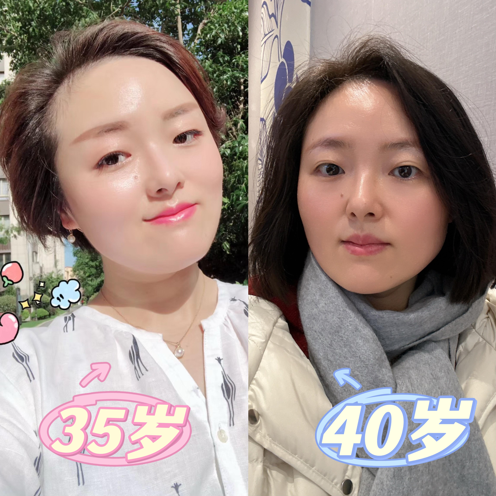

并且我发现，这种垮脸对整个人的状态影响特别大。细纹、斑点、暗黄的问题还能通过化妆掩饰一二，但脸一垮就真的令人疲态尽显，一眼看过去像老了几岁。

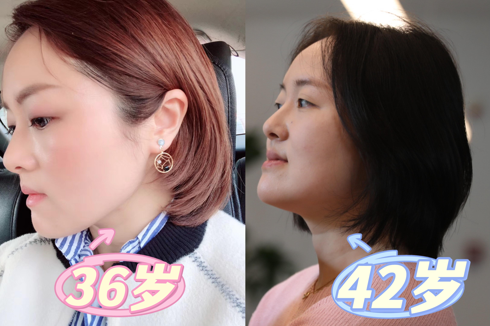

这让我有一天猛然意识到，我不再是“自拍狂魔”了，不那么自恋了，朋友圈都不怎么发自己的照片了，才惊觉衰老焦虑早已蔓延。这几年也因为心急踩过不少坑，好在最终通过努力，慢慢找回了自己的状态。如今法令纹淡化、轮廓收紧的每张自拍，都在诉说：认真抗衰的女人， **终会被岁月温柔以待** 。

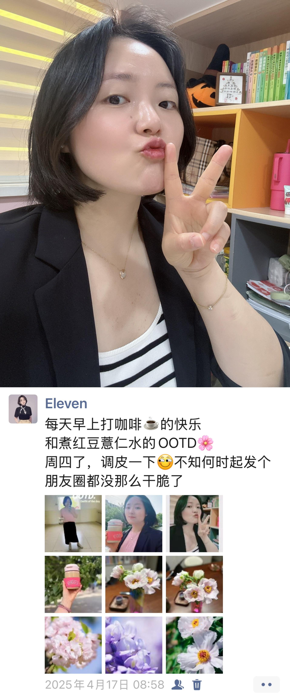

其实，发现自己变老只是一瞬间，这之后更漫长也更重要的事情是：如何让自己老得慢一点、好看的时间长一点。因为科学家发现，中国女性的衰老进程其实从24岁就开始悄悄加速了。到了30到35岁这个年龄段，皮肤松弛、细纹增多这些衰老迹象会变得更加明显。有意思的是，现在很多30岁左右的年轻人，看起来比父母辈当年30岁时的状态更显老！比如我身边不少年轻老师，都开始出现垮脸、法令纹加深、眼袋明显、脸部暗沉这些衰老表现了。可能与咱们这代人普遍存在熬夜刷手机、久坐不运动、饮食不规律等问题有关，再加上职场压力、房贷车贷、养娃辅导作业这些精神负担，都在加速我们的身体老化进程。

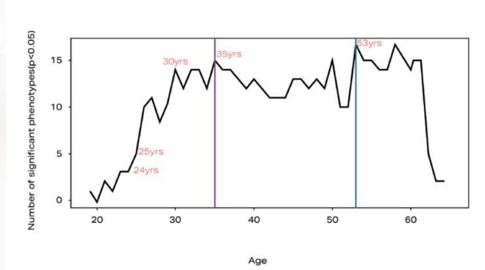

 **其实对于咱们亚洲女性来说，衰老的最关键特征就是垮脸。** 和欧美人相比，我们的皮肤就像薄皮大馅的包子：外层的保护膜（角质层）更薄，里头的馅料（脂肪层）更厚，偏偏骨架还不够立体，缺少支撑。这种组合特别容易"兜不住肉"，年纪轻轻就出现松垮的垂感。而同样是30岁，欧美人的厚角质像防护罩，高颧骨能挂住皮肉，咱们的胶原流失后，脸就像泄气皮球，垮脸尽显。更扎心的是，我们天生角质层更脆弱，动不动就泛红敏感，加上休息不好，暗沉发黄像没睡醒。

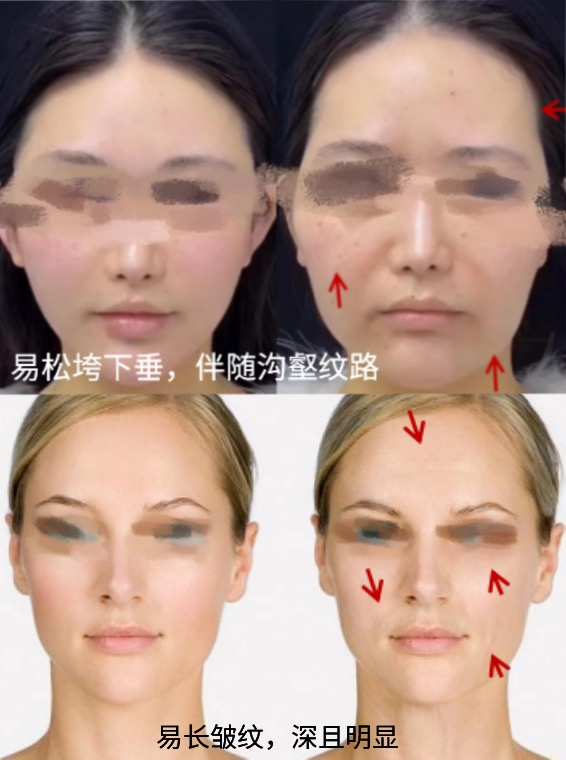

很多女性都知道垮脸是因为胶原蛋白流失，抗老的核心是要补胶原， **但人体内有28种胶原蛋白，具体需要补的胶原是哪些，可能很多人就都不清楚了。** 这就容易出现各种补胶原的方法（像是食补、口服等）都试过了，但效果不理想的情况。

抗衰这事儿得"对症下药"，就像穿衣服要选尺码，补胶原也得挑对“型号”。前面提到咱们的脸垮得快不全怪年龄——亚洲皮薄骨平，胶原流失就像房子抽梁柱，补错胶原类型等于只加水泥不建钢筋，费力不讨好。

在众多胶原中，IV型、Ⅰ型、Ⅲ型胶原和我们垮脸高度相关，其中Ⅰ型、Ⅲ型胶原想必熟悉抗老产品的姐妹都不陌生，这是很多抗老护肤品的主打补充对象，Ⅳ型相比之下有点默默无闻。Ⅰ型胶原就像钢筋骨架，藏在皮肤深层负责撑起轮廓；Ⅲ型胶原更像细腻填充剂，驻扎在浅层抚平细纹，让皮肤摸起来弹润光滑。但其实 **容易被忽视的IV型胶原才是隐藏高手！** 它就像皮肤里的“万能粘合胶”，一头抓着表皮层，另一头把Ⅰ型、Ⅲ型这些支撑型胶原牢牢粘在一起，形成从内到外的立体抗衰网。要是没有它当“粘合剂”，就算补充再多支撑型胶原，整张脸的胶原纤维就像散落的钢筋水泥，根本搭不起紧实结构，脸部下垂、皮肉分离的问题自然难以解决。

那么有没有护肤成分可以同时高效激活这三种胶原蛋白、尤其是至关重要但总被忽略的IV型胶原蛋白呢？有！最近护肤界杀出一匹“胶原激活黑马”——稀有人参皂苷CK（又称Compound K）。它是人参经过转化后形成的终极抗老活性分子，就像同时打开I型、III型和IV型胶原的“金钥匙”。尤其是常被忽视的IV型胶原，普通成分很难精准激活，而稀有人参皂苷CK的焕活效率格外优异，远胜于曾经的抗老顶流A醇。

这个成分堪称抗衰界的全能选手：既能对抗紫外线导致的光老化，又能修护皮肤屏障，还能调节皮肤内部生态平衡。更难得的是，稀有人参皂苷CK不仅精准针对国人抗衰核心的I型、III型和IV型胶原（即"413"胶原组合），有效改善面部松弛下垂问题，还能同步焕活XVII型、V型、Ⅶ型胶原，形成从深层支撑到表层弹润的全维度抗老体系。

别看稀有人参皂苷CK抗老效果这么能打，人家可是个"温柔派选手"！专业实验室找30个敏感肌的女性连用一个月，结果显示没一个人泛红刺挠的。不像某些抗老成分对敏感肌不友好，特别是A醇这种需要谨慎使用的成分，用不好分分钟给你整脱皮，而且A醇类的只能晚上避光使用。但稀有人参皂苷CK就温和多了，既能让胶原蛋白全面稳健补充，又能照顾到敏感肌的女性。毕竟抗老不是受刑，脸皮薄的人也能安心冲。

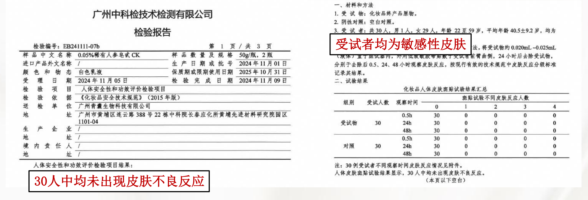

其实，市场上真正含有稀有人参皂苷CK的产品极为罕见。因为这个成分的提取技术难度比较大、研发投入也高，目前亚洲市场凭借更深厚的研究基础和技术沉淀处于领先地位。在为数不多的含稀有人参皂苷CK的抗老产品中，我觉得最值得推荐是谷雨第三代山参胶原霜。因为谷雨采用了全球首创的多酶复合发酵技术，能将该成分的活性浓度提升至天然状态的2000倍以上，这一突破性成果是全球第一例，目前还没有其他品牌实现。

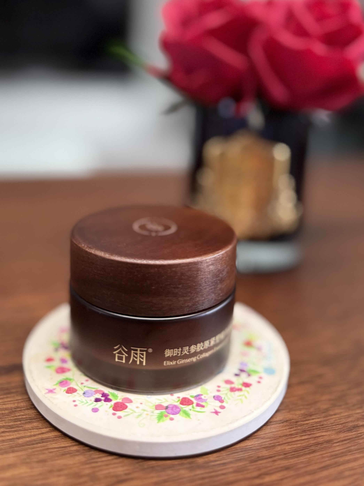

我闺蜜群里有2人都是敏感肌，她们对选择护肤品一直比较严格，自从两年前给我推荐用了美白和修护效果都超级好的谷雨美白奶罐开始，我就被种草谷雨了。后来了解到他家的稀有人参皂苷CK也做得很牛，就冲着这个宝藏抗老成分果断入手抗老面霜。关键是不仅效果强，还不挑人，皮肤敏感的时候用也没问题，实测认证的"敏感肌安全"。

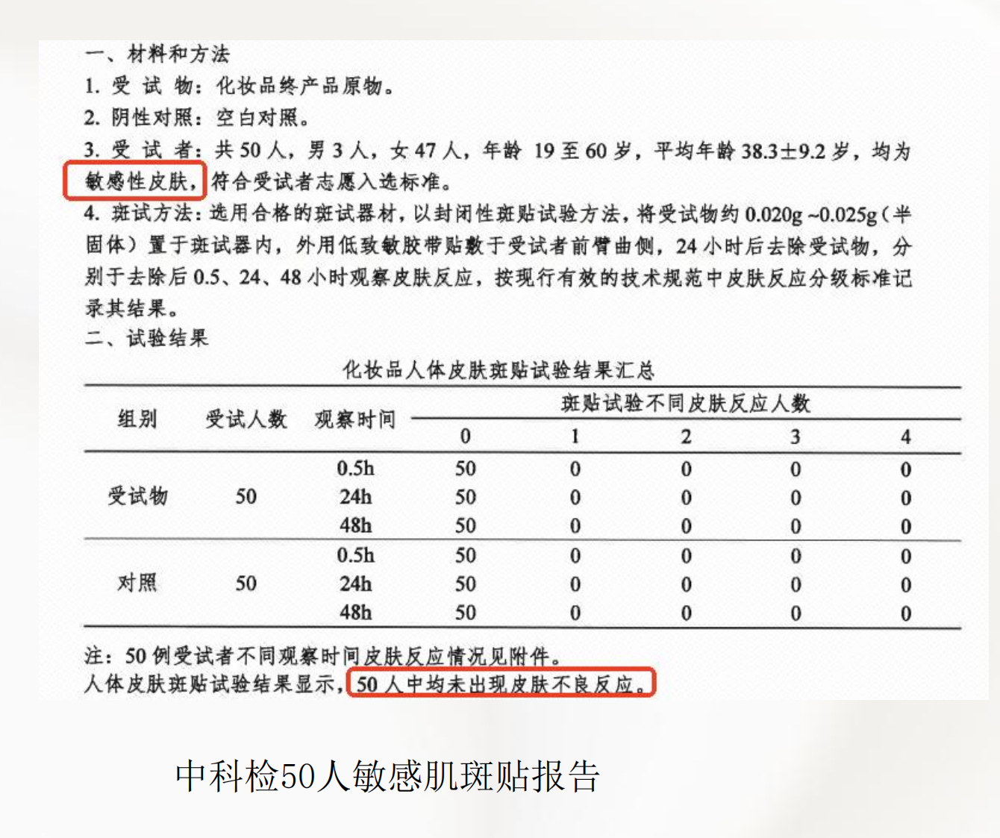

我也是冲着这份"又强又温柔"的特质入手的，自己用下来脸真的紧致了不少， **特别是下颌线比用之前紧致了很多** 。一般有朋友问我也会推荐，大家可以试试看，温和抗老这条路上它绝对是优等生！

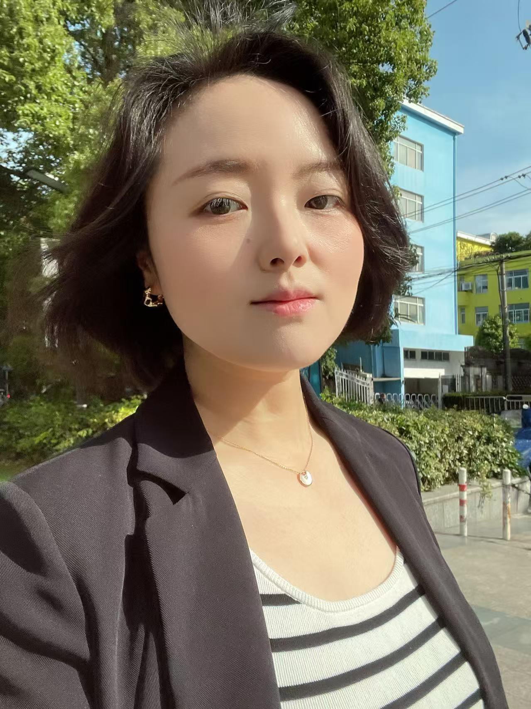

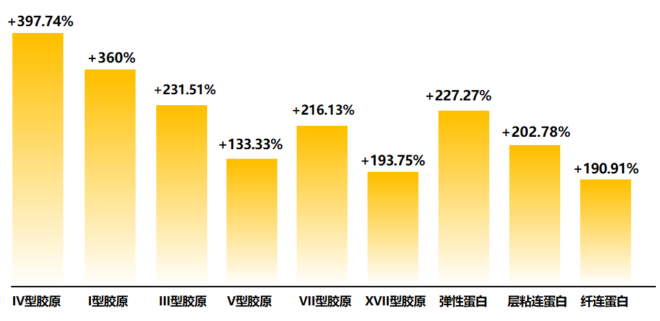

实验数据显示，稀有人参皂苷CK在胶原焕活效率上显著超越传统抗老成分：像有些抗老护肤品容易忽略的IV型胶原焕活率，就高达397%（相当于提升至原有水平的近四倍），焕活效能高达玻色因的3.5倍、A醇的2.4倍。

除此之外，它的I型胶原生成焕活效果是玻色因的1.4倍；III型、V型胶原的焕活能力分别达到A醇的1.3倍和1.9倍。

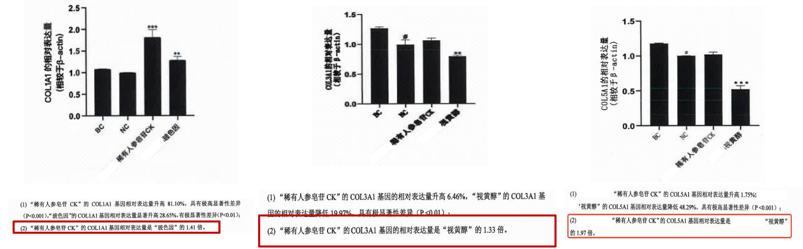

 **不仅焕活胶原，还能把保持皮肤弹力和韧度的蛋白都补齐了，补得既关键又全面，抗衰效果自然好。** 

还有一个我觉得护肤品比较重要的特性，就是好不好吸收，毕竟好东西也要吃到肚子里才有营养。谷雨山参胶原霜就蛮好吸收的，经第三方机构拉曼光谱测试实证，谷雨稀有人参皂苷CK8小时内就能够快速渗透到皮肤底层，吸收性完全不用担心。

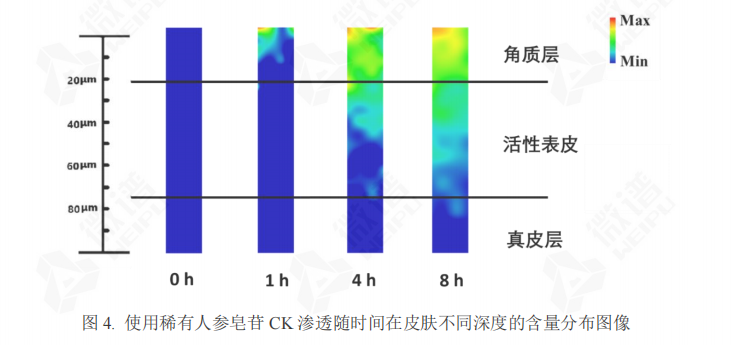

焕活胶原效率强、温和不刺激、渗透吸收快，这样的全能型抗老选手，其功效在实测数据中也得到了验证！

 **实验数据显示，28天的使用周期内，受试者的皮肤紧致度和皮肤弹性都有了显著提升。仅仅使用1个月不到就有这样的效果，很值得想要抗衰的姐妹持续使用下去。** 

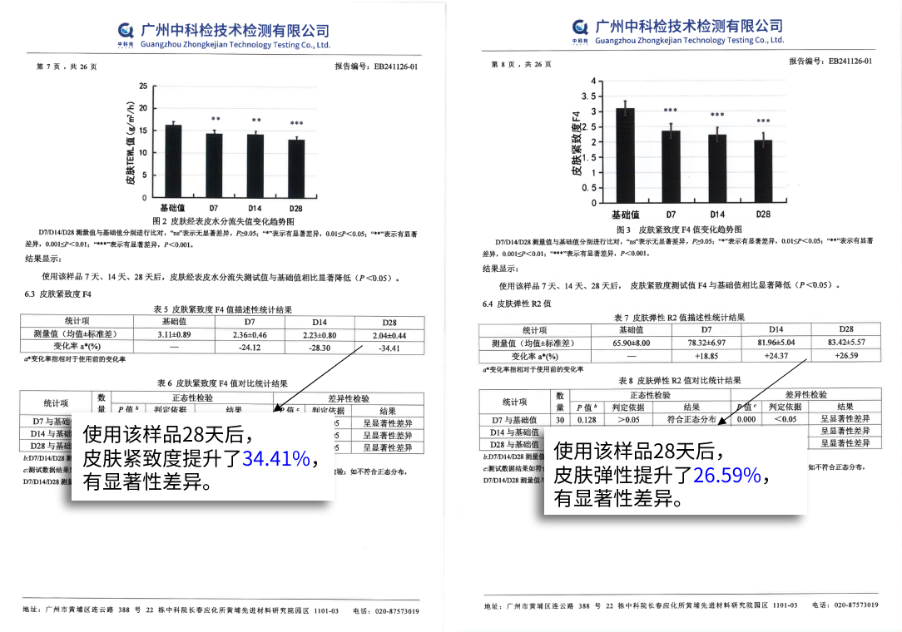

我自己使用的效果也是很惊人的，特意拍照记录了下，左边是使用之前的照片，确实看到我的眼底细纹、黑眼圈比较明显，整个面部下垂、沟沟壑壑很多，尤其法令纹明显。我每天早晚坚持用， **用到现在快三个月了，** 拍了前后对比图，真的惊艳到我了，特别开心！赶紧给闺蜜打电话，说我要一直用下去哈哈。最近同事们也说我气色好，我自己每天照镜子真的肉眼可见的感觉脸比之前紧致了，上妆也更服帖了。

这里可以看出我眼底细纹明显变浅，之前晚睡刷手机、熬夜加班造成的黑眼圈也有很明显的改善，算是一个意外的惊喜，当然还是要配合早睡觉，不熬夜。

两侧法令纹也变浅了，尤其左侧法令纹平整、紧致了很多，同时发现，皮肤更细腻了。

我之前特别焦虑胶原蛋白流失后，我的下颚线不清晰和嘴角下垂的问题，看到这个对比图，我整个人都好了，因为我从小就被夸下颚线很好看，现在我清晰的下颚线又回来了！谷雨山参胶原霜真的让人眼前一亮，在抗衰这条路上给了我很大的信心！每天洗完脸、涂好脸都能看到整个脸紧致提亮了很多。

焕亮的效果其实得益于里面特别添加的品牌王牌原料极光甘草，它专攻暗沉根源！要知道光甘草定的焕亮能力是烟酰胺的140倍、VC的80倍。现在极光甘草直接在这个基础上再翻8倍，相当于把焕亮通路从乡间小路升级成磁悬浮轨道！所以说它能KO暗沉脸，我压根不觉得奇怪，毕竟数据就摆在这儿呢。

不仅如此，谷雨这款抗衰面霜的配方里还藏着两个低调的“焕亮助攻王”：天然抗氧化高手、专门调理肤色不均的紫檀芪，自由基杀手、专治熬夜暗沉脸的牡丹根提取物——当这三个提亮祛黄成分组团出击，相当于给皮肤开了三重保险，皮肤想不亮都难——现在照镜子都能看见透出来的那种水光感！

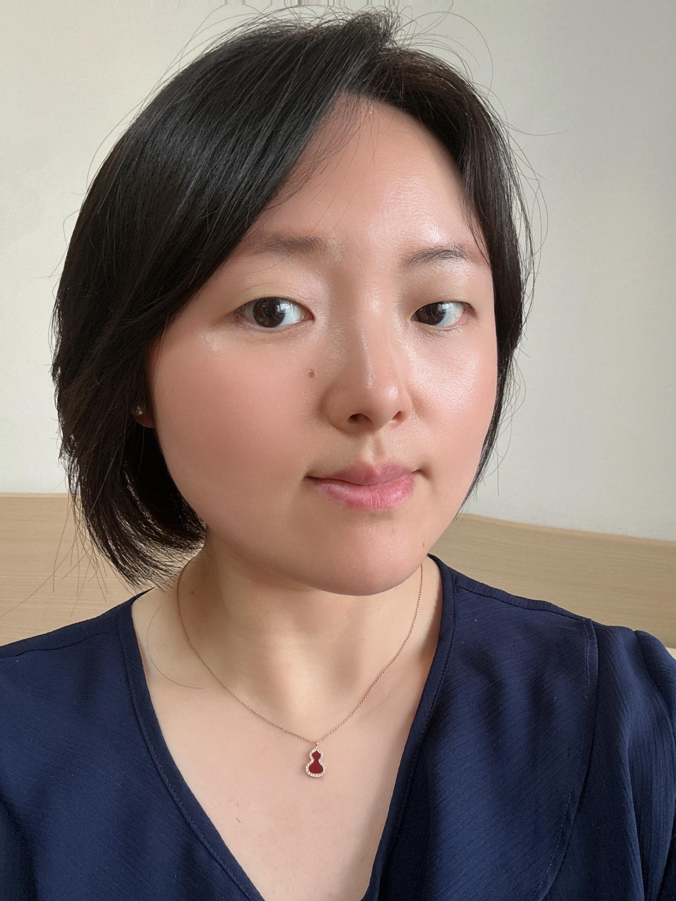

这款面霜我已经给周围闺蜜安利了，有同事说我皮肤好，我也会安利一下，用过的朋友都说不错，要继续用！我用的是经典版，适合所有肤质，一般我也给朋友们推荐这个版本，这款面霜的质地特别讨喜——抹开瞬间就能感受到水润包裹肌肤，但完全没有黏腻感。就像把融化的丝绸轻轻按进皮肤里，接触皮肤时是柔滑的慕斯触感，推开后秒变哑光。油皮用着清爽不闷痘，干皮又能感受到深层滋润，涂完摸脸是那种喝饱水的软嫩感，但表面一点油光都看不见。

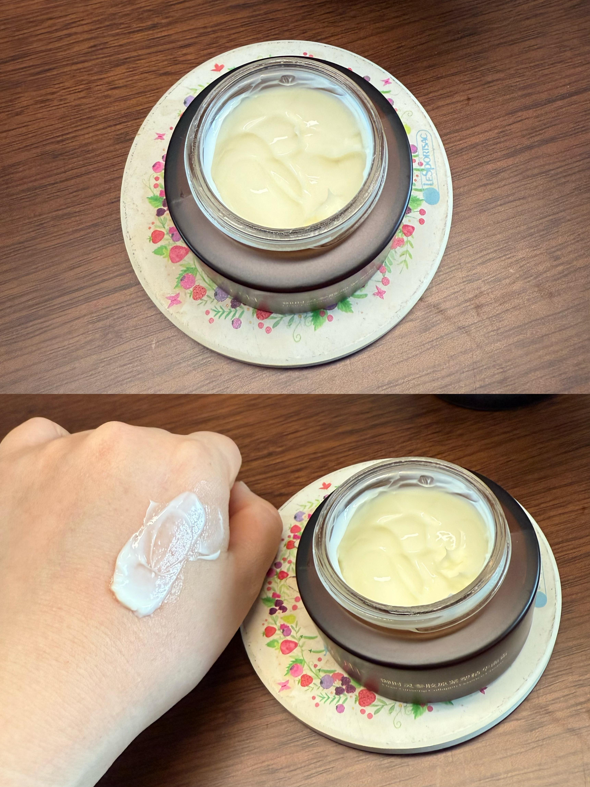

身边一些女性朋友也会问我突然发现自己变老了怎么办，我觉得抗衰老的本质不是与时间较劲，也不是追求昙花一现的"逆龄奇迹"。真正有效的护肤策略，是通过科学验证的成分精准激活胶原（比如能同时唤醒I/III/IV型胶原的稀有人参皂苷CK），注意防晒，及时修复肌肤屏障，保持运动，让皮肤代谢有个健康的节律。当然，要选择经得起数据验证的产品，用日复一日的温和护理，让皮肤在时光中自然保持紧致、透亮的状态。我觉得这才是现代人该有的“智慧抗老观”吧！

  

原文地址：[(Eleven丰收妈妈)突然发现自己变老是怎样一种体验？](https://www.zhihu.com/question/41758350/answer/1911452647640273150) 

# 评论

1. <a href="https://www.zhihu.com/people/wo-you-you-yige-da-dan-de-xiang-fa">手持钢鞭向湾乌</a> (<small title="陕西">2025-8-27 12:9:58</small>): 你这长相不用太关心这些
2. <a href="https://www.zhihu.com/people/feng-jie-10-96">疯杰</a> (<small title="湖北">2025-6-5 10:30:51</small>): 女版郑伊健
   - <a href="https://www.zhihu.com/people/wen-dao-83-76-12">自由自在</a> (<small title="江苏">2025-8-4 20:22:51</small>): 一眼看去还以为是素颜青空光，脸上的痣都一个位置［捂脸］
3. <a href="https://www.zhihu.com/people/li-ye-15-78">黑猫</a> (<small title="黑龙江">2025-8-5 17:18:50</small>): 不是。我怎么觉得你40岁比35岁好看呢。35岁的时候感觉比较凶，40岁的时候平易近人
4. <a href="https://www.zhihu.com/people/steamair">momo</a> (<small title="中国香港">2025-8-10 0:2:37</small>): 总感觉哪里和柴静有点像
5. <a href="https://www.zhihu.com/people/zi-yu-27-32">雾城</a> (<small title="广东">2025-5-31 12:59:23</small>): 因为年纪来了，脂质代谢出问题，所以需要增加运动，控制下饮食
   - **Eleven丰收妈妈** (<small title="上海">2025-6-10 12:29:13</small>): 控制饮食还好说，运动对我比较难，不爱运动［大笑］
   - <a href="https://www.zhihu.com/people/cbpfin">cbpfin</a> (<small title="回复于 2025-8-12 9:56:56/福建"> ✉️:Eleven丰收妈妈</small>): 成熟了更好看［害羞］
   - <a href="https://www.zhihu.com/people/li-shi-hua-63">云想123</a> (<small title="广东">2025-8-19 9:58:42</small>): 想要让国内的人运动，那可太难了，如果不是初高中强制要求出操，估计更多人选择不运动［思考］［思考］
   - <a href="https://www.zhihu.com/people/lao-si-32-78">老四</a> (<small title="回复于 2025-9-10 0:12:45/湖南"> ✉️:Eleven丰收妈妈</small>): 中年人真正开始变老是不再说自己老了［机智］
6. <a href="https://www.zhihu.com/people/chen-hao-46-33-61">Samera</a> (<small title="山西">2025-6-18 13:47:28</small>): 脸垮了的话，可以试试练背，背部肌肉可以把脸皮拉一下
7. <a href="https://www.zhihu.com/people/ch-er">Ch Er</a> (<small title="湖北">2025-6-9 9:59:47</small>): 吃胖胖的就显年轻
   - <a href="https://www.zhihu.com/people/mu-yan-47-23">慕言</a> (<small title="浙江">2025-8-28 13:1:3</small>): 有的人反而不是，越胖脸上的肉越多，一脸横肉更显年纪［飙泪笑］
8. <a href="https://www.zhihu.com/people/To-be-beautiful">追求完美的露丽丽</a> (<small title="湖北">2025-9-10 18:18:43</small>): 你一直都很美丽［爱］［爱］
9. <a href="https://www.zhihu.com/people/she.sung">泰勒展开翅膀</a> (<small title="广东">2025-8-11 15:27:17</small>): 我垮了，我又行了
10. <a href="https://www.zhihu.com/people/83-54-25-64">啊隙</a> (<small title="广东">2025-8-11 9:52:38</small>): 发现大家想停止变老都是进健身房
11. <a href="https://www.zhihu.com/people/Claire-41-2sdfwerwer">医者仁心</a> (<small title="福建">2025-6-1 7:26:37</small>): 形象生动，用自己展示
12. <a href="https://www.zhihu.com/people/la-la-la-38-83-85">喵喵喵大人</a> (<small title="湖南">2025-7-26 0:5:17</small>): 最近一直在告诉我自己，练练背➕控制饮食吧，尽量让自己不虎背熊腰
13. <a href="https://www.zhihu.com/people/chen-chen-83-21-46">好大的风</a> (<small title="河南">2025-8-4 0:7:0</small>): 好看［感谢］
14. <a href="https://www.zhihu.com/people/62-74-38-87">未示</a> (<small title="安徽">2025-9-13 23:24:20</small>): 去年这个时候吧，去理发，突然发现围裙上掉下的头发竟然有许多灰色和白色的。一瞬间，觉得自己老出。
15. <a href="https://www.zhihu.com/people/qian-9-31">看书的文竹</a> (<small title="上海">2025-9-12 14:6:38</small>): 忽然发现白头发今天拔掉明天又长，打完粉底的脸下面还有一条条的皱纹根本遮不住，缓了好几天，接受了。
16. <a href="https://www.zhihu.com/people/huang-huang-zhang-zhang-22-51">渡清风</a> (<small title="黑龙江">2025-8-7 17:4:33</small>): 吃胖胖的就显年轻
17. <a href="https://www.zhihu.com/people/tttttt-29-81">tttttt</a> (<small title="福建">2025-9-10 21:22:18</small>): 接受衰老接受一切［捂脸］
18. <a href="https://www.zhihu.com/people/feng-zhi-dao-6356163928">风知道6356163928</a> (<small title="河南">2025-9-10 13:38:21</small>): 我也脸垮了［大哭］［大哭］［大哭］［大哭］［大哭］
19. <a href="https://www.zhihu.com/people/89-71-3-95">喜欢星期五</a> (<small title="内蒙古">2025-9-10 12:6:49</small>): 看上去还是很年轻，原来变老只在一瞬间。
20. <a href="https://www.zhihu.com/people/jiang-nan-sheng-ge-53">江南弦</a> (<small title="安徽">2025-8-10 9:20:10</small>): 写的不错，很有深意，有数据，有广告，有推广，有价值！［赞］［赞］［赞］
21. <a href="https://www.zhihu.com/people/zhu-yuan-feng-73">木小风</a> (<small title="安徽">2025-8-28 10:12:55</small>): 每个人都要变老啊，变老后有成熟的魅力！我不怕脸变老，但是对于变老后记忆力的衰退，是我极度恐慌的事情［大哭］
    - <a href="https://www.zhihu.com/people/victor-41-89-84">VICTOR</a> (<small title="江西">2025-9-9 14:55:33</small>): 还没有进入老年 我的记忆力就开始衰退了［飙泪笑］
22. <a href="https://www.zhihu.com/people/92-18-8-83-69">流星似我</a> (<small title="广东">2025-8-24 14:54:6</small>): 还是要化妆的，不然颜值就垮了
23. <a href="https://www.zhihu.com/people/wa-ha-ha-49-75-2">元来时你</a> (<small title="江苏">2025-8-21 19:29:18</small>): 谷雨还不错［害羞］
24. <a href="https://www.zhihu.com/people/hongkongxu">赵观杉</a> (<small title="中国香港">2025-8-15 12:1:7</small>): 有点像柴静，单说颜值，无关人品。

=[评论](./attachments/comments.json)

