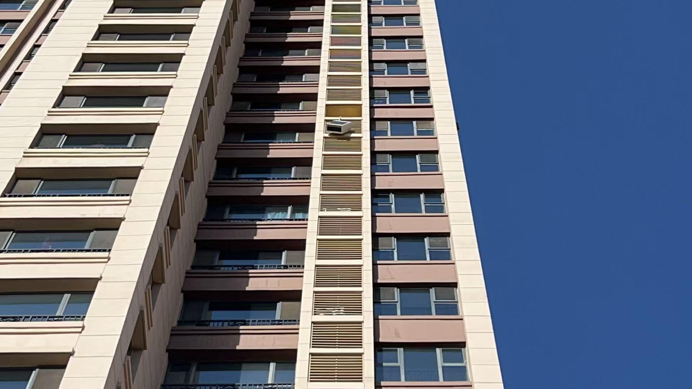

[toc]

# 问题

提问者：**<a href="https://www.zhihu.com/people/nai-cha-21-52">奶茶</a>**
提问时间: 2022-5-13 0:10:19

哪一次让你发现了人性的丑恶?

# 回答

回答者： **<a href="https://www.zhihu.com/people/miao-ren-feng-63">喵仁疯</a>**
回答时间: 2025-11-10 15:3:11
点赞总数: 2120
评论总数: 521
收藏总数: 156
喜欢总数：38

新鲜出炉的事情

老家有房子出租了，今年夏天北方太热，租户要安空调，网上下单了一台空调约师傅上门安装。

空调上午安的，试机没问题师傅啥也没说就走了，下午物业给我打电话说，你们家上午掉下来的百叶窗怎么还不处理，我才知道，安装空调的时候整个外机位置百叶窗连带框架都被师傅弄掉了，从十五楼自由落体到楼下，安装师傅竟然什么都不说就走了。幸好没伤到人。

没办法把打电话把师傅叫回来，也没说什么不好的，就是让他把百叶窗重新装上，师傅这不情不愿的给装上了。就让师傅走了。

就在昨天，家里刮风，物业又给我打电话，让我赶紧回去，我家百叶窗又掉楼下了，不仅如此，外机也掉出去了。我脑瓜子嗡嗡的，这要是砸到人了肯定就摊上人命了，我在北京又赶不回去，只能联系租客和商家赶紧处理，折腾一下午找吊车最后才把外机弄回去，幸好没有伤人。

 **结果复盘发现，就是第一个安装的师傅弄掉了百叶窗之后，对于把他叫回来返工心生不满，百叶窗放上去根本没和墙体固定，而是把百叶窗和空调外机固定到了一起，就盼着你那天出事了。** 

以前我完全没想到人竟然会这么坏，我以为一个人至少要有很大好处收益才值得做坏事，但是这件事这不仅是损人不利己了，是彻彻底底的拿别人生命不当回事，无视他人生命安全，而且还不会从中得到任何好处

看图片就知道，正常情况下即便百叶窗掉了，外机完全不固定放在机位上，也不会有任何问题，多大的风也不可能吹走这么重的空调外机。只能是人为的的就故意弄你才有可能。

对了，空调是小米的，目前小米地区负责人答应去调查事故原因了，不知道会有什么结果

  

原文地址：[(喵仁疯)哪一次让你发现了人性的丑恶?](https://www.zhihu.com/question/532547102/answer/1971231407566193022) 

