[toc]

# 问题

提问者：**<a href="https://www.zhihu.com/people/bu-zhi-ming-de-chang-jing-lu-83">不知名的长颈鹿</a>**
提问时间: 2025-2-7 12:48:13

网页端似乎对于过大过长文本只能做到读取十来万字的部分。不知道本地化能不能做到读取一个几百万字的文本然后根据提出的要求来查找其中的相关内容。

有没有知乎er懂这些的ww

# 回答

回答者： **<a href="https://www.zhihu.com/people/shenmasu">鹤竹子</a>**
回答时间: 2025-10-18 9:47:4
点赞总数: 195
评论总数: 35
收藏总数: 821
喜欢总数：11

我先问你一个问题。

你的知识库，你所有的思考、笔记、文章，如果超过了20万字，你打算怎么让AI处理？

这是个很现实的问题。

谷歌的Gemini，上下文窗口最大是200K tokens，换算成中文，撑死也就10万字。

我的「AI写出我心」专栏，加上我过往的公众号文章，总字数早就超过了100万字。

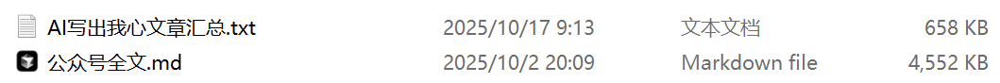

如果我直接把这些东西扔进Gemini，它会怎么样？

它会「 **失真** 」。

它会漏掉东西，它会选择性遗忘，它给你的反馈将是残缺不全的。

市面上有很多号称更强大的本地知识库工具，花里胡哨。

但今天，我不跟你扯那些。

我只给你介绍一个软件，一个你 **必须** 现在、立刻、马上去熟悉的东西。

这个软件，叫  **Google NotebookLM** 。

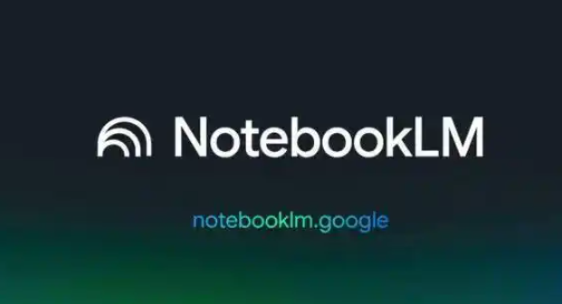

在开始之前，我必须把丑话说在前面。

 **第一，今天我不讲怎么建立个人知识库。** 

那套「 **心法** 」，我们以后再讲。

今天只讲「 **工具** 」。

你必须先把工具摸熟了，否则后面我讲心法的时候，你连软件注册都没搞定，那就别怪我不回答。

 **第二，所有网络问题，自己解决。** 

这个软件是谷歌出的，意味着什么，你懂的。

>  **网络问题** ，你自己想办法解决，别来问我怎么「魔法上网」。我这里绝不提供。  
>  **谷歌账号** ，你自己想办法解决。去海鲜市场（闲鱼）花几十块钱买一个带Gemini的账号，是最简单粗暴的路径。  

如果你连这两步都搞不定，我劝你现在就把这篇文章关了。

咱们专栏只服务创作者，不伺候巨婴。

好了，废话不多说。

如果你还在这里，说明你已经做好了「 **自己动手，丰衣足食** 」的准备。

下面，我们开干。

## NotebookLM：一个不完美的屠龙刀

这玩意儿到底是什么？

简单说，它是一个基于向量数据库的AI笔记助手。

你不用管「 **向量数据库** 」到底是啥。

你只需要记住它最大的一个特点： **能吃** 。

它能让你上传  **300个**  文件。

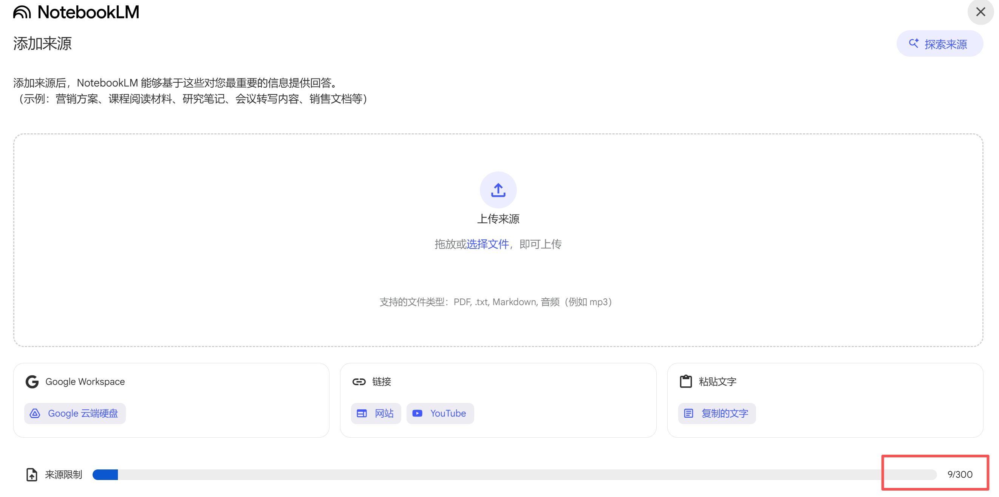

这意味着什么？

这意味着几百万字，甚至上千万字的内容，它都能给你吞下去，并且消化掉。

它怎么帮你消化？

这就是接下来我要给你拆解的教程部分。

下面的内容，我会参考网上的一些资料，结合我自己的使用经验，给你一份详尽的「 **不完全入坑指南** 」。

网址：[https://notebooklm.google.com/](https://notebooklm.google.com/)

### 第一步：把你的知识「喂」给它

NotebookLM的界面极其简洁，甚至有点简陋。

进去之后，第一件事就是「 **新建笔记本** 」，然后「 **添加来源** 」。

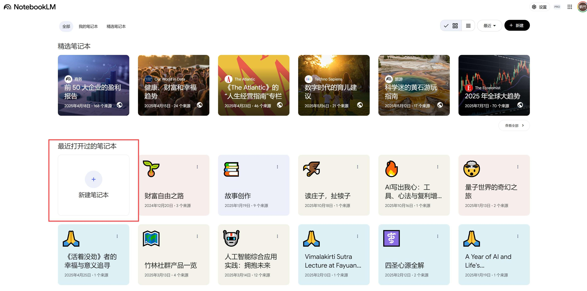

它的包容性很强，几乎什么都吃：

-    **文件上传** ：PDF、Word文档（.docx）、TXT、Markdown... 你电脑里存的那些论文、电子书、报告，直接拖进去。
-    **网页链接** ：看到好的博客、新闻、文章，直接复制链接扔进去。
-    **YouTube视频** ：油管上任何视频，扔个链接，它能把语音自动转成文字。
-    **复制粘贴** ：最原始的方式，直接把文字粘进去。
-    **音频文件** ：非YouTube的视频，你可以先转成音频文件再上传。

这一切，它通通「 **吃得下** 」。

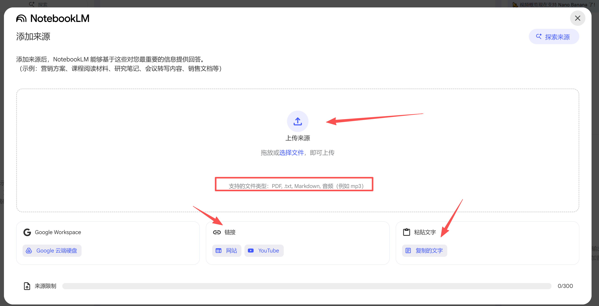

上传后，它都会自动生成一份「 **简要介绍** 」和「 **关键词** 」。

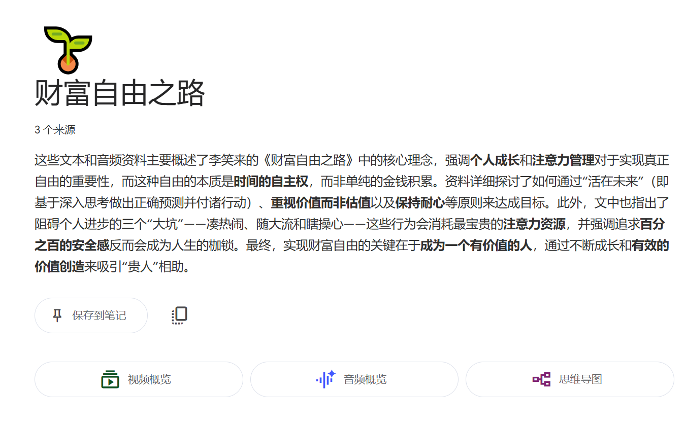

这是AI-Native的第一步：从静态资料，到动态知识流。

### 第二步：三栏式布局，搞懂它的分裂逻辑

NotebookLM的界面分成三块，逻辑有点分裂，你得适应一下。

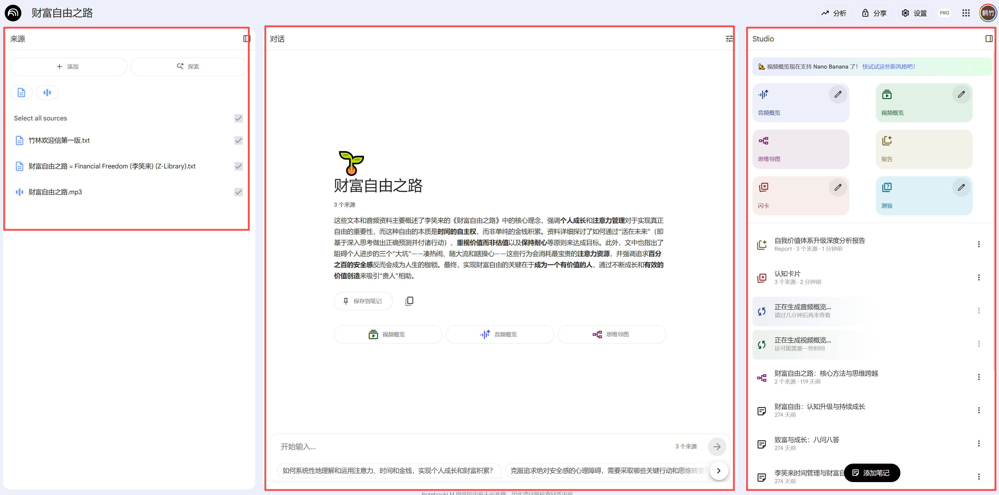

-    **左边：文件管理区** 

-   你上传的所有来源（PDF、链接等）都在这里。
-   免费版最多50个文件，Pro版能到300个，但免费的对我们来说，肯定够用了。

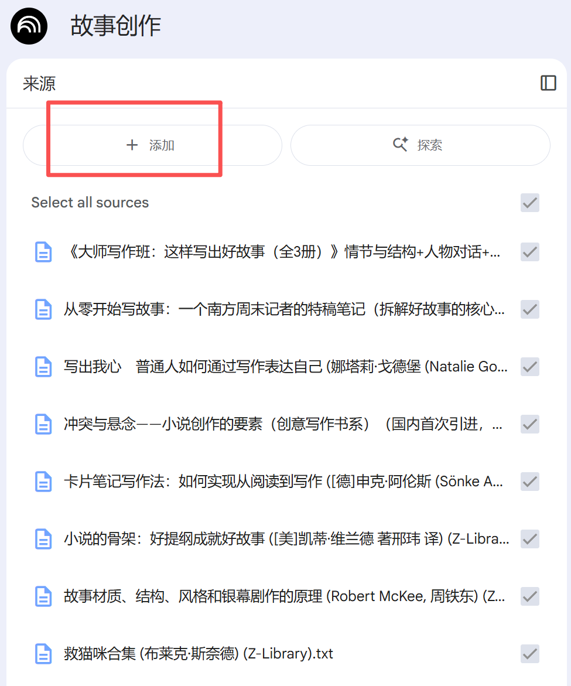

-    **中间：聊天区** 

-   你和AI对话的地方。
-   你可以直接提问，AI也会基于你的文件，推荐一些它认为你可能想问的问题。
-    **注意！注意！注意！**  这里有个天坑：这里的对话记录， **默认不保存** ！你把窗口关了再打开，就没了。你必须手动点击回答下方的「 **保存为笔记** 」，才能把有价值的内容留下来。这跟我们平时用的所有大模型都不一样，一定要记住。

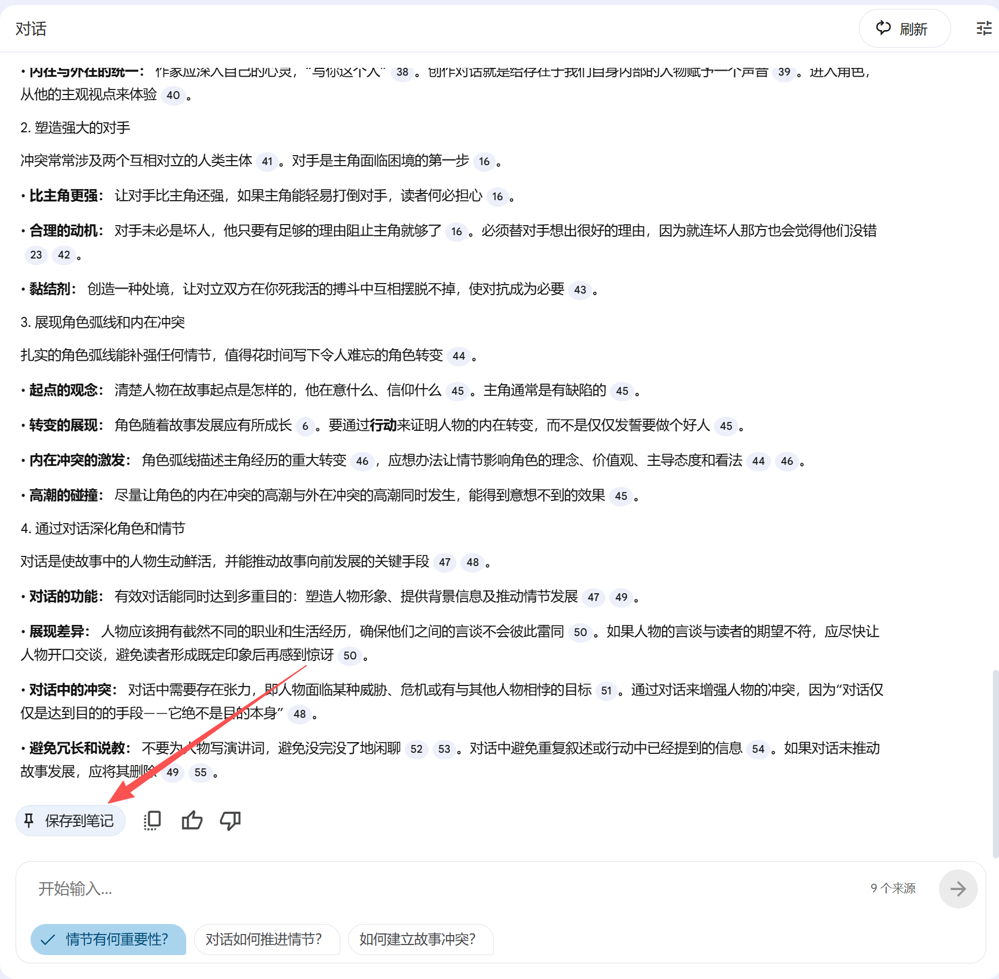

-    **右边：生成内容区** 

-   这是最有意思的部分，也是它区别于普通AI聊天的地方。它提供了6个强大的AI生成功能。

### 第三步：玩转右边的「六大魔法」

这是NotebookLM的精华所在，每一个功能都直通AI。

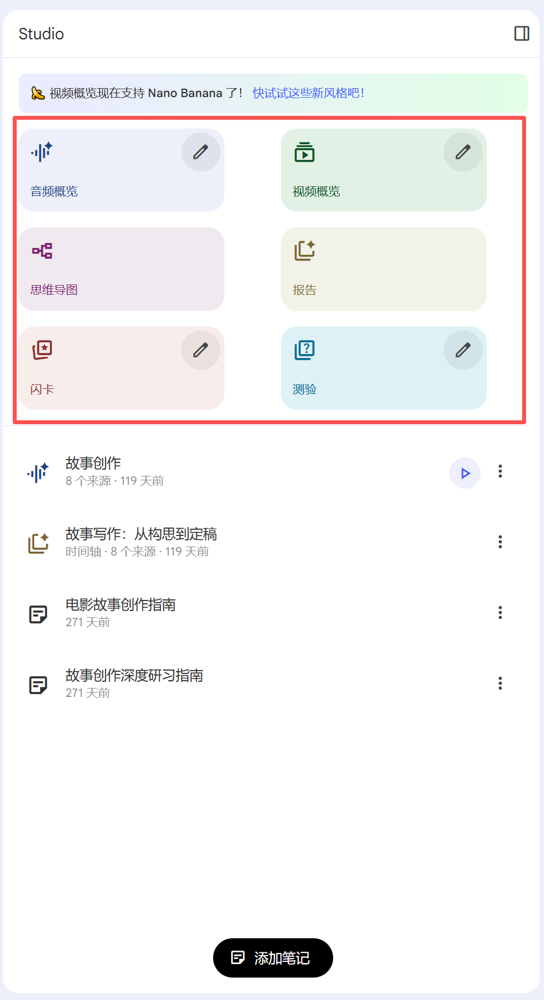

1.   **音频播客 (Audio overview)** 

-   它能把你上传的资料，变成一期双人对话的播客。一男一女两个AI主持人，像聊天一样把核心内容给你讲一遍。
-   我个人很喜欢这个功能。把枯燥的论文或报告转成播客，比自己干巴巴地读，记忆效果好得多。

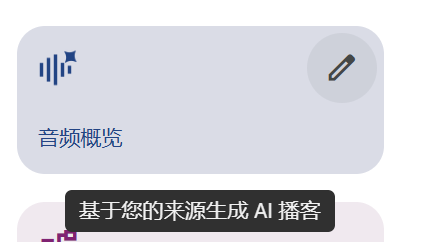

1.   **视频概览 (Video overview)** 

-   它能生成一个PPT授课式的教学短视频。
-   AI会自己做PPT，自己配音讲解。虽然有点机器感，但用来做组会汇报的初稿，或者快速给别人讲解一个概念，非常方便。

1.   **思维导图 (Mind map)** 

-   快速帮你梳理知识框架。
-   最牛逼的地方在于，这个导图是「 **活的** 」。你点击任何一个节点，它会自动把这个节点的内容变成一个问题，输入到中间的聊天框里，然后AI会基于你的所有文件来回答。这才是真正的AI-Native。

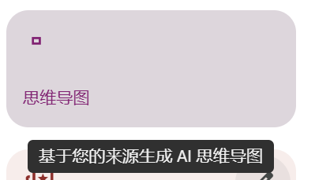

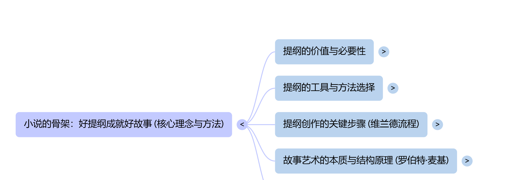

1.   **报告 (Report)** 

-   可以自定义格式，帮你生成一份结构化的报告。
-   比如你可以让它按「 **时间线** 」整理，写综述的时候极其有用。你还可以指定结构、风格、语气。生成的报告质量很高。

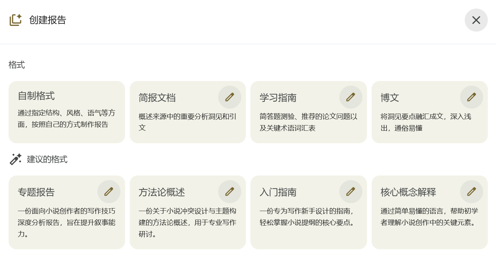

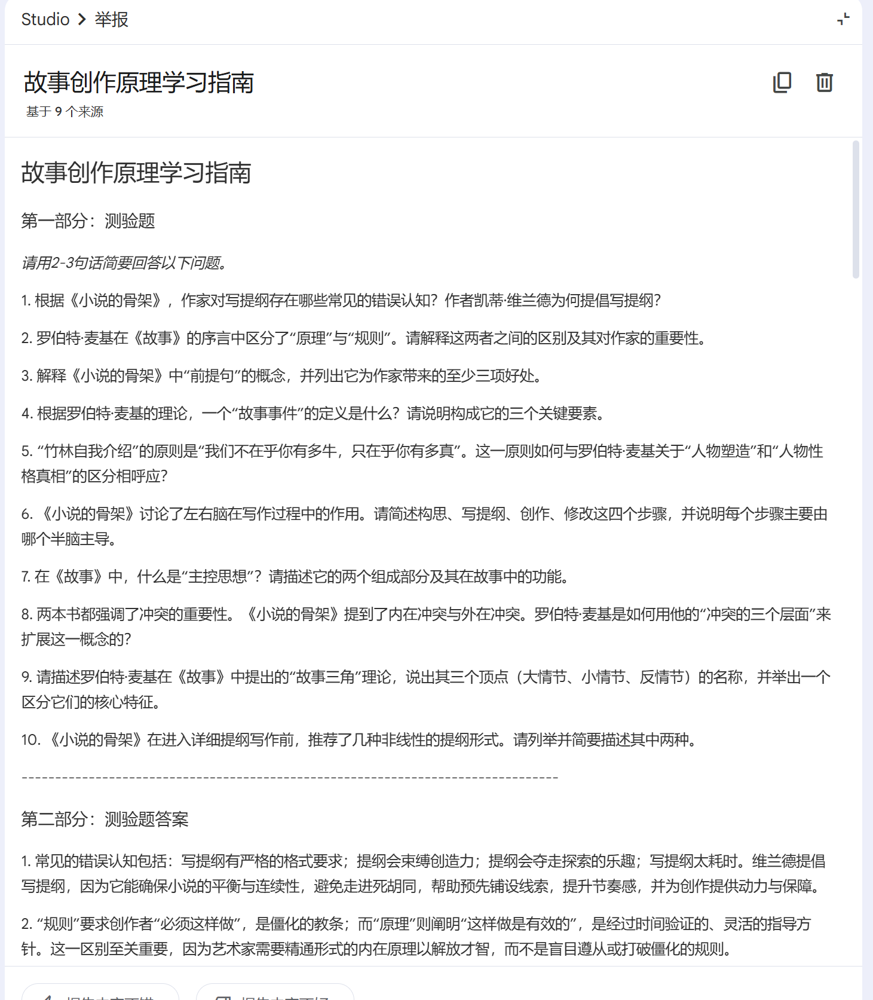

1.   **闪卡学习 (Flashcards)** 

-   自动帮你把知识点做成问答卡片，用来背诵和记忆。备考神器。

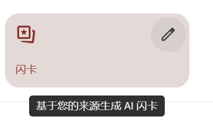

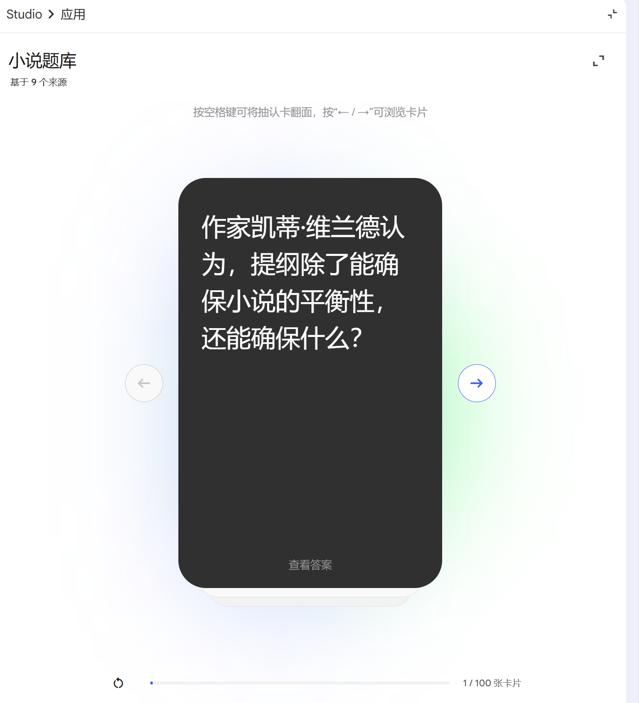

1.   **测验 (Quiz)** 

-   基于你的资料，给你出一套测试题，检验你的掌握情况。从学到考，形成闭环。

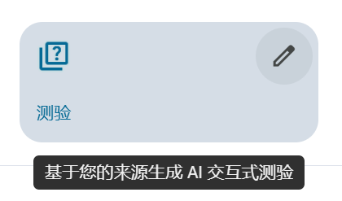

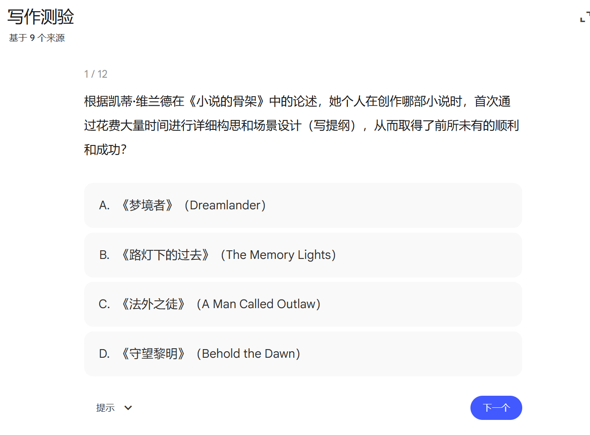

以上，就是这个工具的基本操作。

我要求你，必须上去把这些功能都点一遍，玩一遍。

上传一篇你自己的文章，或者随便找个网页链接，看看它生成的播客是什么样的，思维导图是怎么动的。

你只有自己动手了，才能明白我接下来要讲的「 **心法** 」。

## 这玩意儿，我拿来干嘛？

好了，教程讲完了。

接下来我告诉你，在我这里，NotebookLM到底扮演什么角色。

你必须清楚一点： **工具的用途，是由你的创作流程决定的。** 

在我的工作流里，AI工具被清晰地分成了两类：

-    **干「粗活」的** ：处理海量信息、做初步整理、分类、查找。
-    **干「细活」的** ：精雕细琢、高质量输出、文学创作、风格打磨。

 **NotebookLM，就是那个干「粗活」的。** 

它的智能化程度、交互逻辑，说实话，都挺混乱的。

你别指望它能写出花来。

但它的优点就一个： **有劲儿，能扛** 。

我拿它来干嘛？

举个例子，前两天，我需要把「AI写出我心」专栏的所有文章进行重新梳理和分类，做成一个体系。

上百万字的内容，我不可能在Gemini里处理，如图，根本处理不完，只能处理我最近的几篇。

于是，我把所有文章全部扔进了NotebookLM。

然后，我向它提问：

> 把所有文章，按照「宣告篇」、「启动篇」、「工具篇」、「场域篇」……进行分类，并列出每个分类下的文章标题和核心观点。  

这种大文本的、结构性的、需要全局视野的「 **粗活** 」，就必须交给NotebookLM来做。

它能保证在处理海量信息时，不失真、不遗漏，并且每个回答都能精准地「 **标注出处** 」，告诉你这个结论来自哪篇文章。

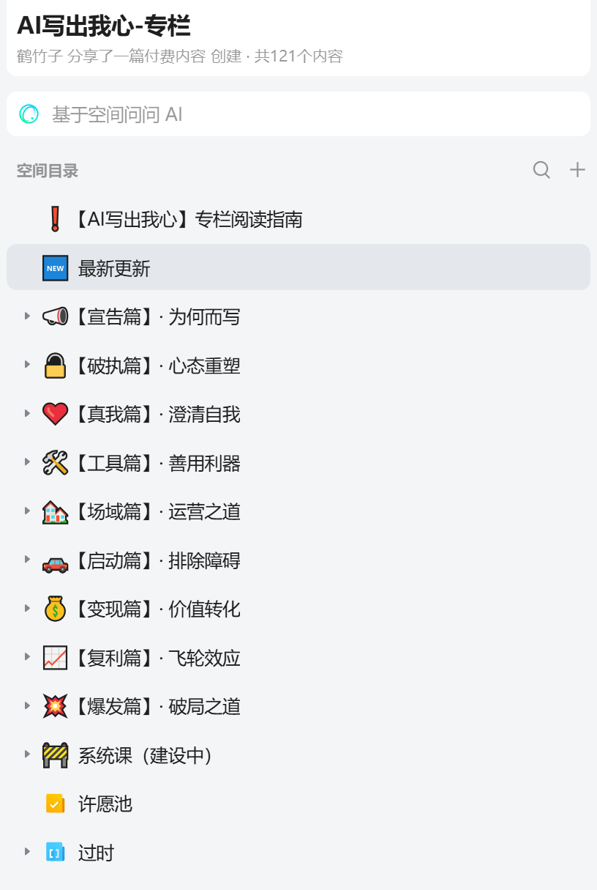

这，就是它的核心价值。

当它帮我完成了初步的分类和整理后，我会把这些结构化的输出，拿到Gemini里。

然后，在Gemini里，进行「 **细活** 」加工。

比如，对某一个「心法」进行更深刻的阐述，或者把某个说明改写得更具故事性。

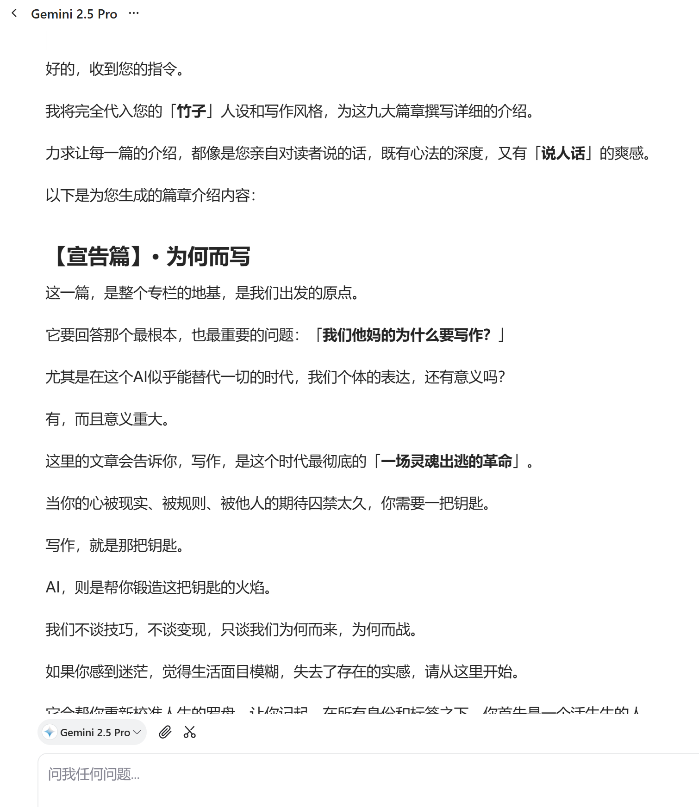

你看明白了吗？

 **NotebookLM 是你的图书管理员和资料整理员，它负责帮你把上万本书整理得井井有条，并快速找到你需要的那一页。** 

 **Gemini 是你的金笔杆子和贴身军师，它负责把那一页的内容，变成一篇能「一秒万金」的爆款文章。** 

千万别搞混了。

别指望用NotebookLM去搞精细创作，也别妄想用Gemini去硬啃几百万字的语料库。

## 今天的任务

好了，该说的都说了。

这篇文章，一半是教程，一半是心法。

我再强调一遍，它的交互逻辑很奇怪，对话不保存，你用起来可能会骂娘。

这很正常。

你就是要去熟悉它的「 **怪** 」，然后利用它的「 **强** 」。

后面的任务很简单：

 **上去，把它用熟。** 

把你的书、你的文章、你的笔记，扔进去试试。

别等我后面讲「 **个人知识库构建心法** 」的时候，你连这个最基础的工具都还没注册，还在问我怎么操作。

到那时候，我可不会再给你留情面了。

行动起来。

___

如果您喜欢这篇文章，想要阅读更多，可以看下面的链接。

[「AI写出我心」，一份通往心灵自由与财富复利的创作邀请函](https://mp.weixin.qq.com/s?__biz=MzU0MTU0NzAyNw==&mid=2247489402&idx=1&sn=a8d5138ac40aa7f82d44787686bb9fe0&scene=21#wechat_redirect)

  

原文地址：[(鹤竹子)deepseek本地部署能做到阅读几百万字文本吗？](https://www.zhihu.com/question/11521332735/answer/1962816933712893936) 

