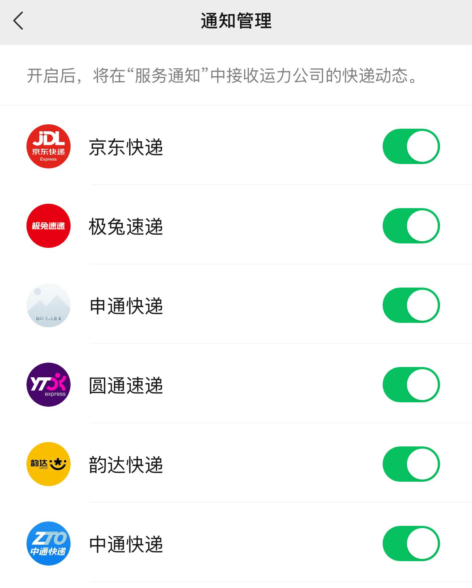

[toc]

# 问题

提问者：**<a href="https://www.zhihu.com/people/feng-xing-yu-7">Acquaintance</a>**
提问时间: 2025-10-15 18:29:15

以前到快递站了会打电话，后来变成只发短信不打电话，现在客户主动去查了才知道快递到站了。

另外，快递站现在不仅需要扫描单号，还需要“身份码”，而且即使是京东买的，也需要到淘宝里单独注册用手机号登录才能显示“身份码”。

是什么导致快递驿站取件如此麻烦？

# 回答

回答者： **<a href="https://www.zhihu.com/people/liu-lan-48-82">流岚</a>**
回答时间: 2025-10-16 3:42:24
点赞总数: 188
评论总数: 240
收藏总数: 212
喜欢总数：14

我也算快递物流行业的从业十年了，给大家理清整个背后的逻辑吧，也给很多人一些启发，如果能提前预知一些情况，将来的商业安排或者生意模式变更，兴许也能有点帮助，其实很简单。

结论先行： **未来的末端配送，早就被规划成增值服务了，现在正在做的措施就是逐步的减少2C的配送上门，要改变从08年至今养成的用户习惯，“送货上门”，将来是服务分层的时候了，想要在家等待送货上门，就得花钱。** 

快递行业，尤其是加盟制的“通达系”快递，其核心商业模式就是极致的成本控制。当“送货上门”的人力成本与电商件极低的客单价产生不可调和的矛盾时，将高成本的服务（上门）剥离出来，变成可选的“增值服务”，是资本和市场演化的必然结果。

“送货上门”这四个字甭管是公司广告还是服务体验，你看看现在谁还在提起呢？

因为资本，当初顺丰、韵达、申通、中通及普洛斯它们牵头的丰巢，以及阿里系的菜鸟驿站。

菜鸟13年涌入市场，丰巢顺丰他们为了对抗阿里系，就创建丰巢15年涌入市场。

进而改变了整个末端配送的运营模式，一直到今天，诸位难道没发现一个什么现象吗？

用户习惯早已悄然改变，润物细无声。

物流快递行业外的人，有一点感知不到，就是用户的投诉率。

自从驿站和快递柜的普及，网点的铺设，我曾经分析过，投诉率整体下降了约60%左右（以当年唯品会的数据为例，其他公司我不知道），并且是逐年降低。

当然，并不是一蹴而就，中间也经历过漫长的投诉转移，比方说态度类投诉就转成了未经联系私自放快递柜但不方便去拿的种类等等。

显著降低的就是未经允许私自签收的投诉。

因为以前没有驿站和快递柜的时候，你但凡敢签收不打电话，客户就敢投诉，有时候发短信客户可能真的没看到。

但是有了驿站和快递柜，你签收了，客户便不会在意了。

因为这背后还有一个底层的逻辑，自快递诞生十数年来到今天都没有改变，就是快递员的工资是计件工资，并且要把这个包裹妥投成功，也就是签收才开始计算钱。

简单来说就是一个包裹到了站点，今天配送，联系客户，客户在外地，家里没人，说后天回来，让快递后天配送，那么这个包裹，要到后天配送成功才有计件工资，1块钱到账。

如果客户后天临时有事没有回来，又需要延期3天，那么也就是快递员从拿货当天，到5天后，总共配送三次，才有1块钱进账。（当然我说的是早期，驿站和快递柜没有普及的时期）

我讲明白了吗？这样的模式下，驿站和快递柜，既可以让快递员当天完结所有的妥投。后面的配送就是全新的包裹，极大的降低了重复配送妥投。以当初我记忆中唯品会的数据为例，重复妥投降低约25%左右。

上面讲完了驿站和快递柜的诞生以及诞生后的影响，以及对快递员的便利，下面讲“阳谋”。

丰巢是由几家快递公司共同创建上面已经讲了，下面讲运营。

哪怕你是这几家公司的配送员，你去送快递，要使用丰巢，同样还是要收费的，没错，要收费。

大家都知道快递员的单票妥投计件费用是1块钱，甚至有些区域已经到了0.8元，当然，这配送费主要还是三通一达，顺丰和京东以及早期的唯品会曾经的配送费不止这么点儿，这就涉及到3PL和公司直营落地配的区别了，这里不细讲。

那我们按照1块钱的配送费来计算，配送员放菜鸟驿站的费用是0-0.5元之间，这个需要站点和驿站或者自己和驿站去谈。我们假设取均值，0.25一票，那么这个配送员送这一票就是1-0.25=0.75元。

而放到快递柜里，就是0.3、0.4、0.5元小中大柜。也就是说，配送员把手上所有包裹送完，全部放在驿站和快递柜的情况下，最高收益也就是0.75元最低收益就是0.5元。

这些配送费，进而又转回到了快递公司手里。导致快递员越想挣钱，花出去的钱就越多，总公司的收益也就越大，进而更促使上层极致的KPI诞生，鼓励区域单个快递员的配送密度。

难道各位没有发现，现在的快递配送越来越快了吗？

当然这背后肯定有基建，公司的线路优化，网点铺设的范围等等原因，但是十年前的飞机十年前的火车，十年前的高铁，速度和今天的速度还是一样的。以前除了顺丰和京东可以在相应的区域达到次日达。现在所有快递公司，只要你不是特别偏，基本也就第二天第三天就到了。

因为现在的末端配送，不存在迟滞了。

你们有多少年没有投诉过快递到站点却没有配送员领货配送的投诉了？

站在公司的角度，我的派费没有张，逐步在减少，从最开始的1.8左右到现在的1块左右，末端配送的速度反而提高了（这里讲速度可能不严谨，从业者说效率，用户说速度），投诉率还减少了，公司还能通过驿站和快递柜又返回0.25-0.5元。

这部分钱就可以拿来拓展公司业务线，基础服务，IT运维，等等，以及拿来竞价对抗，所以自从丰巢15年创办后，顺丰、韵达、申通、中通几家快递公司在15到21年，股票逐年递增，为什么是到了21年呢？因为20年至今，诞生了一个业务线，同城配。然后公司就进一步陷入了极致的成本压缩和扩张中。

又导致了快递员末端配送的派费在21年和23年又下调了一次。

所以这也就是为什么当初24年邮政总局颁发的快递新规，让全国的快递公司不允许私自放快递柜发行的时候，导致了罢工，站点加盟商纷纷退场，后来触底反弹就放宽了。

到这一步，大家应该明白我在说什么了。

从稳定的状态中，只能是走向更稳定，今后的主流，基本上就还是去驿站或者快递柜拿快递，想在家自由收快递，很难达到了，市场规模，用户习惯，已经成型了。

 **所以为什么现在快递驿站取件越来越麻烦了？因为这是数字化的进程。要规避到再也没有人能够冒领，偷盗，等情况发生，应对全新的数据隐私法规（监管与技术维度）。** 

___

为什么会变成今后“上门配送”肯定会变成增值服务这样？

因为人口，快递员，外卖员这种岗位，放眼望过去，有多少占比是正儿八经的大学生？都是上了年纪，没有一技之长，且背景低微的社会边缘人群。（兼职过度的除外，这些人的基数本就在少数）。

加上国内学历内卷，大学生找不到工作，却也不愿意从事这类岗位，为什么？懂得自然懂。

5年后呢？10年后呢？起码在这几年，这些公司可没有有多余的闲钱来给配送服务涨派费，那就只会陷入死循环，不体面、报酬少、风吹日晒雨淋、工作时长长的工作就越不会有年轻人接纳。

不要想当然的说什么连外卖都能给3-4块一单，为什么快递配送费却只能是0.8-1.2之间，一个残酷的事实，这0.8-1.2已经占了30%及以上的物流链路的总成本了，还是在极致的压缩下。

要知道有些电商老板发快递都是2块钱一票甚至1.8元全国，乃至1.5的我也见过。

还能怎么涨呢？

所以目前的情况就是最后一公里，早就不是末端配送的根本痛点了，是末端人力成本占比，是利润可压缩空间在逐步缩小，趋于临界值了。

本来就0.8-1的配送费，快递员到手也就0.5-0.75了。再压缩一次，哪怕一次，快递员到手变成0.4-0.6的时候。。。。可想而知。这还只是压缩0.1元。但凡压得再狠一点呢？

而且驿站和快递柜的普及，除了使最后一公里的效率倍增之外，还有2点最重要的意义。（站在公司的角度，当然不是消费者的角度。）

1.加盟商的额外收益。

驿站经营者从快递公司处按件收取服务费。然而，其商业模式的核心和未来，在于利用取件服务带来的稳定且高频的线下客流，来驱动其他增值业务的销售。这包括社区团购、生鲜零售、零食饮料售卖，以及其他便民生活服务 。

这种物流+零售的模式，本身就一种可回血的、可持续的小微商业体，然后反过来又会强化它在末端物流网络中的核心地位，让它变得基本没办法动摇。

2.巨大的隐形成本转移。

你在家等快递，可以完全想干嘛就干嘛，去驿站你得下楼吧？人多你得排队吧？如果人家驿站卖零售，你看到了香蕉，苹果，车厘子，冰淇淋，会想吃吧？然后就买对吧？然后边吃边等边买，拿完快递还得走回家吧？这一来一回的所有成本，其实都是原先快递员的成本，现在被转移到了消费者身上。

说到这里。

为什么至今还有人觉得快递柜蛮好，驿站还不错呢？也是快递柜和驿站这种对用户利益冲突的模式能普及的原因。

当初我也做过用户画像分析。

1.打工人。（这是“罪魁祸首”，占了80%的原因）

2.高档小区物业。

3.快递员等从业人员本就是社会边缘人物，综合素质整体相对较低，并不愿意家门口暴露隐私等安全隐患。

4.女性关系。（别误会，不是搞男女对立，看下面我说完）

5.隐私面单。

打工人自不必多说，白天上班出门，晚上下班回家，路过驿站或者快递柜，非常方便，顺手拿了，快递员送家门口，出租屋甚至都没人接收，放门外又怕遗失，打工人特喜欢。送的也快，取货也方便。真的，但凡大家都小康了，都在家里，夫妻和睦，老人小孩都在，老家上班做生意，不内卷，快递柜和驿站这玩意儿，根本诞生不起来。

高档小区的物业那真是，也不说狗眼看人低吧，反正自有他们的标准，外人进不去。和第三点也是强相关。我在唯品会的时候，就经常接到下面站长诉苦，被投诉不配送，送又送不进。喊客户到门口来拿十个有六个不愉快。

女性关系是指真的那帮没素质额快递员，要么就很凶，要么就长得很危险，要么就......懂得都懂。

我以前真的处理过很多投诉，就是什么快递员猥琐啦，闯进女生家门口啊，什么奇奇怪怪的都有，所以，驿站和丰巢它快速普及了。

隐私面单是当初从三联单或五联单极致压缩成本搞成现在的热敏纸单，成本极低，但为了隐私不泄露，隐去很多东西，如果是新人配送员，拿到手上，真的没办法配送，有些地址不是熟人真的找不到。。。。。。

丰巢超时还得收费，虽然现在收敛了一些，但依旧是隐性成本的转移。最恐怖的是，大家貌似都接受了（我说的是大基数），所以现在快递公司处理投诉基本上可以分两类，一类是催货的让它更快，一类是为什么我的包裹没经过我的同意就放在驿站和快递柜了。后者的比例越来越少，这也是我前面说的这么多年，“调教”的成果。

所以真正收网的那一刻，不会太久了。

以后送货上门要收费了，最后一公里变成增值服务。

因为这就是多方面影响而达成的三元悖论，也就是不可能三角：

1.市场和消费者要求 **低成本。** （比方说“包邮”，实际上消费者说的包邮，最终还是商家帮出了邮费，那商家没办法转嫁，只能极致压缩）

2.消费者和传统习惯要求 **高便利。** （比方说送货上门）

3.政府法规强制要求 **严合规** （国家法规要求必须征得用户同意才能存放驿站/快递柜，并保障数据隐私）

最终的解决办法就是 **服务分层** 。

所以，另一部分群体（居家办公者、全职父母、老年人），我没资格代这个行业向你们抱歉，但确实，今后想在家安心等快递，不太可能了。要么就花钱搞增值服务。。。。

因为打工人实在太多了。你们只是少数群体。毕竟买快递多的也都是我们这帮人打工人。。。。

我知道这是默认选项的暴政，但......我是没办法改变。我经常匿名投诉我自己的公司，但公司还是会查到。因为给我配送的快递员从来都不送到我楼上，然后VP就来埋汰我。。。

 **等到过几年，你们就会发现驿站取货会越来越方便了。。。。。。** 

技术现在也在迭代。多平台也在签收协商互联中，推动不同物流平台之间的标准统一和数据互通，以解决跨App获取“身份码”的问题。等什么时候经济压力再次增大的时候，这个进程一旦达到，我上面说的这事儿，它就来了。

___

看到这里，大家应该可以明了了，可以得出一个很浅显的道理：

 **所有曾经低价劳动力的服务模式，将来都会变成增值服务，或者科技技术取代。** 

这也是经济发展的必然演化结果，就像评论区老哥说的预制菜，道理都是一样的，后厨的厨师人力成本和时间成本过高，预制菜可明显压缩成本，想吃到最开始的平价现炒，就需要付出更多的成本，也就是现在的高端餐饮了。

以餐饮店为例，经过这么多年的演化，多少平价餐饮店都是自助点餐+凭取餐码自己取餐了。所以奉劝一句，想自主创业，经商的朋友们，要尽量去研习这背后的逻辑，去相信数据分析，不要幻想着开个店，做个小本经营就可以马上致富。

比较好的方向就是基础服务升级。实体行业真是重灾区，涉及什么承包，租赁，加盟，开店，装修，千万千万慎重，那个道理再提一次： **在淘金热中，真正赚钱的是卖铲子的人。** 

尽量选择低成本/0成本，利用现有科技与自身优势的结合，去进行基础服务的升级，现在网上爆火的帮人整理收纳柜、家政清洁、上门维修装机、跑腿、同城配、顺丰车，家教。无一例外就是在基础服务升级。新时代的技术和思维，去创造差异化的价值，实现“版本迭代”

就举个例子，你如果在互联网公司上班，和几个同事关系不错，凑合凑合喊帮忙建一个微信小程序，你贴个二维码，和老家小区的物业聊一下，小区帮忙遛狗，每周末一个月8天，上午一次，下午一次。加点费用还可以给狗子洗澡，顺便去谈某个宠物店或宠物医院的保险，通过时间发酵，你自己也真诚坦荡的话，一个月下来，赚个小两三千，上不封顶，不算太难的事儿，完全的轻资产。随时可撤，还能转手，这就是基础服务升级。

如果你是一个程序员，你也可以帮小区的驿站写一个小程序“邻里送”，让社区的人注册，大量的散劳动力，如宝妈、退休人员、自由职业者、大学生等。他们注册成为“社区配送员”。可以去帮助小区的老年人、残障人士，以及不想下楼的“懒人经济”用户。完成一个社区内的经济自我循环。每一个人都可能是需求者和服务者。同一栋楼的邻里，也会很愿意做这个事情。特别是邻里关系不错的人。不光是快递，任何需要人力服务的，都可以实现。这就是提供铲子的模式。

___

10.16修改：

和提问者在评论区发生了一些观点上的争议，本来前面准备把图片截图发上来，现在因为太长了，发上来也没人看，这里也不争论谁对谁错了。再多说一些吧，正对菜鸟和消费者体验的事儿来说一下。

先强调一点：如果今后去菜鸟驿站领取快递包裹得到了刁难，必须要在门店下载推广app才可以领取包裹，你当场打开手机录音，再问店员一次，是不是不下载你的推广app就没办法领取快递？对方回答了是，就OK了。然后你关掉录音，下载app，先把快递领取。然后回家打开邮政总局的网站进行投诉，要注册账号，知乎上也有人教你如何投诉。小红书也行。我自己也写过一篇回答。

[怎么找到对应的快递派送员电话或者对应的派送网点电话?](https://www.zhihu.com/question/406853887/answer/1349144332)

邮政总局投诉官网：

[邮政业申诉服务平台](https://sswz.spb.gov.cn/portal/home)

PS.别再来一些人说什么邮政总局投诉没用的，真的，这帮人真的是认知问题，没得救。身为从业人员，我可以很负责的告诉你，邮政总局现在2025年，对接的方式可能和以前我写帖子的时候不一样，但是绝对是企业重点关注的。绝对是有用的。如果你投诉了没有用，你私信我，我帮你投诉。

  

然后再说一下，发这个帖子的回答内容呢，是想说一下背后的逻辑，有些地区取件困难，被菜鸟驿站恶心到了，原因很多元，起码以我的视角来说，客观存在的原因就是各大app平台本就数据不互通，本就是孤立系统，其二就是当初也是因为菜鸟驿站发展过程中有很多冒领，窃取，错领的情况，所有后面为了加强末端的验证，搞了一个额外的身份码的验证。然后某些地区驿站加盟商，因为在站点推广下载app会有相应的推广费，所以才导致了有些驿站存在恶心人的情况，所以这时候就需要进行投诉，来让这些驿站进行改变。

所以我才没有直接说阿里or菜鸟驿站就是为了赚推广app的费用就是这个原因，因为不是所有的驿站都是这么操作的，我至今没有下过菜鸟app以及额外扫身份码，还是有很多加盟商没有这么操作。但明眼人应该能从回答中看出，我绝对没有帮阿里or菜鸟“洗白”，因为我没有任何立场。

  

顺便再提一下，如果包裹到达了驿站，不管是菜鸟还是多多还是其他驿站，以及快递柜。收不到短信提醒，或者微信和支付宝的app提醒。有这么几个操作方向：

1.看看短信拦截设置。

2.反诈的app设置。

3.京东/淘宝/拼多多等平台app把号码隐私关闭。  
（这里说明一下为什么要关闭号码隐私，并不是说关闭了以后，你的号码就公开了，而是快递物流系统，或者是驿站系统，现在都是系统后台一键发短信，设置好的虚拟号码发送，早就不是很多年前快递员拿着快递一个一个的去发送短信了，而号码隐私就是把你的号码也变成虚拟号，最后的结果就是虚拟号发送到虚拟号，加上很多短信拦截，反诈拦截，等等多重因素，就导致了你收不到快递短信，还要自己去app上看物流动态才能看到包裹已经到了。关闭号码隐私就是不使你的手机号码变成虚拟号，如果你特别注意，而且也不想收短信，就在微信或支付宝，服务通知里把快递服务设置好通知就行。）

4.打开微信和支付宝搜索服务通知-快递服务。把各种快递都勾选上。

  

原文地址：[(流岚)为什么现在快递驿站取件越来越麻烦了？](https://www.zhihu.com/question/1961861183721177721/answer/1962000386287207328) 

