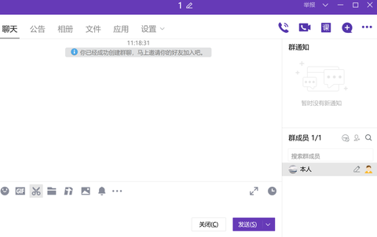

[toc]

# 问题

提问者：**<a href="https://www.zhihu.com/people/zhang-xiang-50-2-82">张先生</a>**
提问时间: 2018-2-23 21:55:44

从校门到机关大门，初到机关工作，对人对事都有很多不适应，大家有哪些忠告么？

# 回答

回答者： **<a href="https://www.zhihu.com/people/wei-ya-feng-64">谬师娱笑颠</a>**
回答时间: 2023-7-17 16:32:10
点赞总数: 3282
评论总数: 148
收藏总数: 8172
喜欢总数：213

仅针对普通公务员。

 **1.进去第一天，拿到全单位的通讯录。** 

记主要领导和办公室主任的手机号码和座机号到手机，手机号不方便给也要记座机。

怎么拿，去单位的总办公室拿。

防止BOSS打你电话的时候，你来一句：“您好，请问您哪位”。

可能有些地方会放在OA或者别的什么软件里，新人在什么都不懂的情况下，直接去单位办公室就行。

有电子版的最好，记住一个原则，这东西你要随时方便查到，不管你用什么办法。

 **2.了解你要从事的主要工作** 

怎么了解，翻翻邮箱和前辈的电脑，聊天的时候问同事。

 **3.了解单位的正副职领导都是谁，以及他们分管的工作。** 

一般而言，某个副职领导会成为你的分管领导，他对接你的科室或者股室领导工作，你科室或者股室的领导带你干活。

大BOSS→副职分管领导→科室领导→你

 **4.了解各个科室或者股室负责的工作，以及他们的负责人。** 

比较大的单位职能会比较庞杂，了解个大概就行，拿到通讯录，一般他们会标注哪个办公室有哪些人，对着看一看就行，心里有个数。

 **5.建一个只有自己一个人的Q群，能作为你自己的移动网盘用。** 

不涉密的材料和报表，你辛辛苦苦码出来的材料，直接丢进去，大文件记得临时文件转正。

注意: **涉密的文件就不要传了。** 

方便下班开车回家的时候，领导打电话给你要材料，直接在群里找，编辑一下就行了。

当然，对于我而言，这个习惯帮过我大忙，比如说某次核查材料，需要找到一个六年前的一个表对数。

嗯，六年前，某个加班的下午，某个超大的表格，某一个小时里的历史版本，当时报送的是打印以后的纸质材料。

还好，只要对外发的材料，不涉密的我都会顺手发一遍在群里上传一次，直接按日期找，就找到了。

 **6.可以准备一个专门用来工作的微信小号或者手机号。** 

现在三大运营商都有开副卡服务，一个月10块，目前各个手机品牌都有微信分身的功能。

 **7.如果你用苹果手机，可以额外准备一台安卓水桶机用来工作。** 

要求：内存大，256G够用，懒人不经常清理的话直接512G，操作起来不卡，续航久，夏天室外不容易发热。

因为，很多工作用APP，只有安卓版。

顺便，也可以把工作和生活分开。

 **8.对接任何领导和关键工作业务员的电话，电话一定一定要设置自动录音。** 

领导电话里说的一大堆东西，你真的记不住的，需要录下来听第二遍慢慢细品。

 **9.遇到棘手的事情，多请示多汇报。** 

很多事情就是领导才能拿主意。

你不是领导，你就是个工作人员，你不要想太多，很多时候那些两头堵的事情就是要领导拿主意。

汇报的时候，要注意说明白 **“堵点”** 在哪，最让你棘手的是哪些点。

其实工作久了你会发现，有很多问题，领导也决定不了，领导的领导也解决不了，单位的大BOSS还是解决不了。

最后还需要各个部门的大BOSS开个碰头会研究定调。

 **10.任何工作，都要留痕，方便以后你返查。** 

有些留痕，就是拍照，比如去哪开会调研了，可以拍照，然后发工作群里。

有些留痕，只能自己知道，不然容易被抓把柄，比如上面一个人的QQ群，拍照发进去，就是只有自己知道的留痕。

有些留痕，是请示和汇报。

比如说，遇到任何两头堵的事情，编辑一段 **条理清晰又简短** 的文字，发到领导微信，请示领导应该怎么做。

保险起见，发微信以后，再电话请示领导，并录音。

又或者，遇到超级两头堵的事情，涉及多个单位和上级部门，千万一定要记得打一个请示给上级部门。

当然，不管什么请示，都要记得先问自己的分管领导和股室领导的意见。

有时候一个请示都不够，需要多打几个请示给上级部门。

 **11.不管人前人后，最好不要在同事面前说别人的是非。** 

只听别人说八卦就行了。

 **12.体制内的代沟非常严重。** 

字面意思上的代沟，差个十岁甚至五岁，可能平时聊天就可以鸡同鸭讲了。

 **13.上班时间别乱发朋友圈。** 

 **14.下班时间也别乱发负能量朋友圈。** 

 **15.买一个自用大屏幕（个人习惯，可无视）。** 

非涉密部门，去某鱼上淘一块二手4K大屏幕显示器，有点坏点有划痕也可以，但不影响正常使用就行，搬回单位自己用，码字爬格子的时候，感觉会好点。（我是家里的显示器正好更新换代了，挂咸鱼也卖不了多少钱，悄悄自费办公）

 **16.收到文件，转给领导并请示意见的时候，不要就把文件原封不动的丢给领导，就问领导意见。** 

领导很忙的，没这么多时间细看。

你要想办法组织语言，在聊天框的几行字内就把文件的内容和要求大概描述出来，包括文件的来源单位，我们要做什么，做完了以后要报给谁，是谁要求报的，时间是否很紧急等，让领导看之前，对文件内容能有个大概了解。

实在不会就把关键的段落截图发过去。

 **17.发函给别的部门要求提供材料的时候，记得写限定日期。** 

不然，等反馈等到猴年马月吧。

 **18.手上有材料最好就做完，别拖。** 

不过，做完了马上就交给领导是一回事，做完了卡着最后期限再交给领导是另一回事。

永远的最后一条：

 **体制内总有一些老油条，总想着怎么坑新人占便宜，新人在他们眼里就像砧板上的鸡，有时候会拉你做壮丁。** 

应对办法：把脸皮磨厚一点，除了工作以外别跟他们有太多交集。

其实你平时就完成你分管领导负责的工作和大BOSS直接交代的工作就行了，更别说上面会时刻发文，有新的本职工作还等着你去做。

鸡毛蒜皮的事找上门的话，如果不是顺手就能解决且耗费时间相当长的事情，直说你分管或者大BOSS要你去干XX工作，限时完成，直接溜。

 **尽量不要在没经过你分管同意，或者没经过单位研究决定的情况下，工作时候去做任何你职责以外的事情，哪怕你真的很闲，也要装着很忙在你的工位上。** 

另外也不要不好意思拒绝，你要这么想，老油条们根本就没有为你自己的切身利益考虑过，只想着自己好，单纯就是把你当炮灰，万一发生什么事还要你自己担责，平时你的本职工作遇到困难，他们一般也是什么忙也帮不上。

  

原文地址：[(谬师娱笑颠)对一个初到机关的公务员，有哪些忠告？](https://www.zhihu.com/question/267603107/answer/3122666420) 

# 评论

1. <a href="https://www.zhihu.com/people/luo-sheng-men-3-59">肖申克学雷锋</a> (<small title="河南">2024-6-3 20:36:33</small>): 学学曾国藩，教员，陈老总，尽快打出自己的工作风格，寻找一位主频相符，人品靠谱，沉默进取的领导作为人生导师，就是坚定不移地抱大腿。
   - <a href="https://www.zhihu.com/people/jian-dan-cu-bao-de-xiao-ke-ai">简单粗暴的小可爱</a> (<small title="江苏">2024-6-13 15:26:11</small>): 他一大堆不知道再说什么，你这一段话是精髓
   - <a href="https://www.zhihu.com/people/qi-meng-1942">彼得-虚空</a> (<small title="陕西">2024-6-18 19:5:21</small>): 说白了，找到和自己风格差不多的大佬然后献上自己的忠诚，让自己有个“组织”依靠
   - <a href="https://www.zhihu.com/people/luo-sheng-men-3-59">肖申克学雷锋</a> (<small title="回复于 2024-6-23 20:46:11/河南"> ✉️:彼得-虚空</small>): 对。一个人能力再强也走不远。必须找到信仰，建立组织，成立团队，互相激励着向前走，或许能够做成些事情。
   - <a href="https://www.zhihu.com/people/zhang-le-39-65">张乐</a> (<small title="回复于 2024-7-12 17:20:21/内蒙古"> ✉️:彼得-虚空</small>): 站队是很危险的
   - <a href="https://www.zhihu.com/people/qi-meng-1942">彼得-虚空</a> (<small title="回复于 2024-7-12 18:12:20/陕西"> ✉️:张乐</small>): 如果自己足够强大，自然能成为被拉拢的第三人，但更多时候会变成两边棋手的棋盘。
   - <a href="https://www.zhihu.com/people/zhang-le-39-65">张乐</a> (<small title="回复于 2024-7-16 9:9:34/内蒙古"> ✉️:彼得-虚空</small>): 是的
2. <a href="https://www.zhihu.com/people/yu-guo-10-22">大脸猫</a> (<small title="河南">2024-6-4 12:50:11</small>): 原来很认同，现在感觉一般的工作不配，累死累活白干［捂脸］随便干干得了
   - <a href="https://www.zhihu.com/people/xiang-nan-4-54">南子</a> (<small title="河南">2024-11-9 12:59:45</small>): 在体制内经常混的表示赞同，只让人感受到虚头巴脑，油滑，没有背景，新来的实诚点，差不多有礼貌就行了，还真当自己是职称精英［大笑］
   - <a href="https://www.zhihu.com/people/ding-dong-72-40">薛定谔</a> (<small title="江西">2024-12-29 11:24:34</small>): 我的职级天花板不允许我太过积极
3. <a href="https://www.zhihu.com/people/9-20-66-13">糖若</a> (<small title="山东">2024-6-5 7:19:47</small>): 文件上网略有不妥，现在查泄密查的很严，难保哪天不会上岗上线。有移动办公软件的话可以放移动办公软件里。再就是电话录音千万别被发现，私自录音被别人知道了会惹麻烦。其他的讲的都挺好的，学习很多。
   - **谬师娱笑颠** (<small title="广西">2024-6-5 11:33:31</small>): 国家应该出一个内部用的聊天办公软件，光OA不够。
   - <a href="https://www.zhihu.com/people/gyouka">momo</a> (<small title="回复于 2024-6-5 16:30:26/浙江"> ✉️:谬师娱笑颠</small>): ［捂脸］浙江这边有浙政钉，但是开会的时候会再三强调有些文件不能在浙政钉上发。
   - <a href="https://www.zhihu.com/people/fei-long-zai-tian-6-16">古月照今尘</a> (<small title="回复于 2024-6-6 10:22:44/广东"> ✉️:谬师娱笑颠</small>): 我们广东有个粤政易政务微信，我一般都发那里。
   - <a href="https://www.zhihu.com/people/chen-joker-37">CHEN JOKER</a> (<small title="回复于 2024-6-16 1:3:40/广东"> ✉️:古月照今尘</small>): 粤政易还是很安全的 文件都是加密的，必须通过粤政易打开，除非另存为［doge］
   - <a href="https://www.zhihu.com/people/ye-lan-wo-ting-feng-chui-yu-27-66">夜阑卧听风吹雨</a> (<small title="回复于 2024-7-30 16:16:10/山东"> ✉️:谬师娱笑颠</small>): 我们有山东通，但是基本没人用，还是老用微信［捂脸］
   - <a href="https://www.zhihu.com/people/xbai-38">x白</a> (<small title="回复于 2025-7-9 22:28:10/海南"> ✉️:momo</small>): 不行自己就搞一个nas存资料
4. <a href="https://www.zhihu.com/people/wang-hao-yu-98-55">Parvis</a> (<small title="新疆">2023-9-14 11:3:28</small>): 工作文件往 qq 群扔是吧，保密工作怎么干的？
   - **谬师娱笑颠** (<small title="广西">2023-9-14 11:23:8</small>): ［飙泪笑］要不你把全国的QQ工作群和微信工作群都举报一遍。
   - <a href="https://www.zhihu.com/people/26-62-96-54-9">听风吹雪</a> (<small title="回复于 2024-8-14 16:0:31/重庆"> ✉️:谬师娱笑颠</small>): 这个可以通过搭建个人NAS来管理，免得真被人举报了［捂脸］
   - <a href="https://www.zhihu.com/people/yuwei-89-63">南昌yuwei</a> (<small title="回复于 2024-8-20 20:45:25/湖南"> ✉️:谬师娱笑颠</small>): 不如wps自动上传
   - <a href="https://www.zhihu.com/people/gai-zao-wen-si-dun">超时空军团兵</a> (<small title="回复于 2024-8-22 13:22:32/北京"> ✉️:谬师娱笑颠</small>): 别笑，很多文件严格来说不能走私企途径。这种东西马化腾真能偷出来。
   - **谬师娱笑颠** (<small title="回复于 2024-8-22 14:59:48/广西"> ✉️:超时空军团兵</small>): 那WPS也别用了。
   - **谬师娱笑颠** (<small title="回复于 2024-8-22 15:42:53/广西"> ✉️:听风吹雪</small>): 这个的确更稳，但是技术要求相对于大多数公务员的工作需要而言，属于杀鸡用牛刀。
   - <a href="https://www.zhihu.com/people/evliu">不逆</a> (<small title="山东">2024-11-18 10:50:2</small>): 新疆是新疆，口里是口里［调皮］
   - <a href="https://www.zhihu.com/people/79-95-52-39">我见青山依旧</a> (<small title="回复于 2025-2-14 9:2:17/湖北"> ✉️:听风吹雪</small>): NAS是什么，怎么搭建？
   - <a href="https://www.zhihu.com/people/la-la-la-56-15-79">啦啦啦</a> (<small title="回复于 2025-9-10 14:24:37/安徽"> ✉️:超时空军团兵</small>): 马化腾偷给谁［好奇］倒不如说所有用苹果手机保存工作文件的更危险，信息外泄出国了
   - <a href="https://www.zhihu.com/people/gai-zao-wen-si-dun">超时空军团兵</a> (<small title="回复于 2025-9-10 16:37:54/湖北"> ✉️:啦啦啦</small>): 理论上有漏洞就不行。
5. <a href="https://www.zhihu.com/people/qian-jian-zou">浅间奏</a> (<small title="四川">2024-6-11 14:32:17</small>): 实话来说，现在抓工作秘密不严，但还是尽量别往QQ上扔，装个u盘都行（那种有typec口的）  
 
我就是干机要的［doge］
   - <a href="https://www.zhihu.com/people/wang-yu-qing-98-46">Vivalavida</a> (<small title="福建">2024-7-6 18:22:5</small>): 不能乱插啊
   - <a href="https://www.zhihu.com/people/wo-zai-96">我在</a> (<small title="河南">2025-6-15 17:6:58</small>): 能说出这话的可能不太适合干机要
6. <a href="https://www.zhihu.com/people/xiao-wang-zi-dian-xia-59">小王子殿下</a> (<small title="安徽">2024-6-8 20:50:48</small>): 老油条能不得罪就不要接触，长舌妇能不接触就不接触，抱领导大腿，和大多数能相处的人相处
7. <a href="https://www.zhihu.com/people/jing-di-zhi-wa-53-18">井底之蛙</a> (<small title="上海">2024-6-4 12:48:42</small>): 《方便下班开车回家的时候》
   - <a href="https://www.zhihu.com/people/he-he-68-5-71">RayFiled</a> (<small title="四川">2025-5-5 10:1:37</small>): 上过班就知道了，领导干部经常被他的大领导拉去，一开就是一天会。只有下班回去才处理业务和文件。这时候你已经溜了，但是你必须速速提供。
8. <a href="https://www.zhihu.com/people/qxrrhj-44">西月锦绣</a> (<small title="天津">2024-7-7 16:39:4</small>): 这么上班太累了
9. <a href="https://www.zhihu.com/people/da-zai-gan-yuan-69">毁灭吧赶紧的</a> (<small title="甘肃">2024-11-3 10:25:34</small>): 第5点，文件这些发到微信文件传输助手，不是更简单么
   - <a href="https://www.zhihu.com/people/dang-yue-liang-lai-qiao-men">小朱要优秀</a> (<small title="河南">2024-11-17 18:54:10</small>): 微信文件有大小限制 微信在办公方面确实不如QQ
   - <a href="https://www.zhihu.com/people/di-qiu-qiu-chang-29">风吹头疼</a> (<small title="山西">2025-7-30 17:55:11</small>): 而且微信信息还会过期，但是QQ消息会一直保存［思考］
10. <a href="https://www.zhihu.com/people/lincoln-33-47">lincoln</a> (<small title="陕西">2023-11-17 11:28:45</small>): 最后一条遇到这种老油条该咋办啊
    - **谬师娱笑颠** (<small title="广西">2023-11-17 12:10:58</small>): 脸皮厚点别理他，除非是你分管，是你分管的话，电话设置自动录音，其实所有跟我有业务往来的我都是自动录音，
    - <a href="https://www.zhihu.com/people/lincoln-33-47">lincoln</a> (<small title="回复于 2023-11-17 13:28:57/陕西"> ✉️:谬师娱笑颠</small>): 谢谢老哥，马上入职了，很担忧
    - <a href="https://www.zhihu.com/people/xi-xi-99-30-36-22">嘻嘻嘻嘻</a> (<small title="回复于 2024-9-1 12:18:50/北京"> ✉️:谬师娱笑颠</small>): ［流泪］老师，你好我想问一下，我已经说了领导让我干别的了，他就在那边骂骂咧咧说你帮我一下怎么了balabala，［可怜］还跟我吵。但是我性格忍不住那种，他跟我急我就也急，我就说：那您来帮我干么？！您怎么老是这样？有没有啥更好的解决方法呀［流泪］我要被这个老油条烦死了……
    - **谬师娱笑颠** (<small title="回复于 2024-9-1 19:9:2/广西"> ✉️:嘻嘻嘻嘻</small>): 跟他讲先做完这个，这个是领导要求必须做的，做完了才能帮他，至于什么时候做完领导安排的工作，看你的进度了。［捂脸］
    - <a href="https://www.zhihu.com/people/xi-xi-99-30-36-22">嘻嘻嘻嘻</a> (<small title="回复于 2024-9-2 0:54:37/北京"> ✉️:谬师娱笑颠</small>): 呜呜老师［流泪］，我是讲了呀，因为我要写个工作年度汇总，肯定是一时半会搞不完，当天要交上级部门。  
 
他一个他负责工作的表格非要俩人一起弄［流泪］，那部分不归我管的，而且就是个会议资料。我是有礼貌地拒绝他的，所以不懂我拒绝之后他急什么，给我都整蒙了……
    - **谬师娱笑颠** (<small title="回复于 2024-9-2 4:9:14/广西"> ✉️:嘻嘻嘻嘻</small>): ［捂脸］那你别急啊，反正完不成是他的责任又不是你的，你是千万不能接，不然他完不成的话会怪你。
    - <a href="https://www.zhihu.com/people/xi-xi-99-30-36-22">嘻嘻嘻嘻</a> (<small title="回复于 2024-9-4 19:39:20/北京"> ✉️:谬师娱笑颠</small>): 好！！！［可怜］
    - <a href="https://www.zhihu.com/people/xi-xi-99-30-36-22">嘻嘻嘻嘻</a> (<small title="回复于 2024-9-4 19:39:33/北京"> ✉️:谬师娱笑颠</small>): 谢谢老师！！［可怜］［可怜］
    - <a href="https://www.zhihu.com/people/79-95-52-39">我见青山依旧</a> (<small title="回复于 2025-2-14 9:4:18/湖北"> ✉️:谬师娱笑颠</small>): 录音这种事很影响人设啊，除了那种丟饭碗的锅，一般情况我觉得得不偿失呀
    - <a href="https://www.zhihu.com/people/lukas-93-30">Lukas</a> (<small title="回复于 2025-2-14 9:45:36/贵州"> ✉️:我见青山依旧</small>): 不不不，我现在所有电话都录音，现在记性差了，很多话记不太全，有录音可以保证记漏了也有机会能听第二遍。
    - <a href="https://www.zhihu.com/people/yu-zhou-chang-wan-78-16">渔舟唱晚</a> (<small title="回复于 2025-3-8 2:33:54/安徽"> ✉️:我见青山依旧</small>): 录音是为了回听啊，很多时候别人说一遍过一会就忘得差不多了。而且你电话录音别人又不知道
    - <a href="https://www.zhihu.com/people/miku-32-3">Kamome</a> (<small title="回复于 2025-3-20 8:32:18/安徽"> ✉️:我见青山依旧</small>): 为什么你会让别人知道你开录音了
    - <a href="https://www.zhihu.com/people/79-95-52-39">我见青山依旧</a> (<small title="回复于 2025-3-20 8:37:29/湖北"> ✉️:Kamome</small>): 开得时间长了，内存不够［捂脸］
11. <a href="https://www.zhihu.com/people/pi-pi-mao-8-85">皮皮猫</a> (<small title="湖北">2025-3-7 18:0:4</small>): boss为啥要打你电话，办公室主任联系不上，直接联系小卡拉米吗［思考］
12. <a href="https://www.zhihu.com/people/starlove-21">StarLove</a> (<small title="重庆">2023-7-18 7:40:45</small>): qq群学到了
    - <a href="https://www.zhihu.com/people/chong-tian-sha-yu">冲田纱羽</a> (<small title="安徽">2024-6-4 11:56:57</small>): 真不如WPS会员
    - <a href="https://www.zhihu.com/people/wang-si-ting-29">漫漫</a> (<small title="回复于 2024-6-13 15:12:25/四川"> ✉️:冲田纱羽</small>): 那不是还要花自己钱［酷］
13. <a href="https://www.zhihu.com/people/mu-mu-ri-tian-30">借钱过日子</a> (<small title="福建">2024-6-4 15:52:33</small>): 录音最多自己听听 可千万别拿出来对质
    - <a href="https://www.zhihu.com/people/pi-nuo-cao-42-13">Vierundzwanzig</a> (<small title="黑龙江">2024-6-4 20:17:35</small>): 那录音是干嘛用的啊？
    - <a href="https://www.zhihu.com/people/mu-mu-ri-tian-30">借钱过日子</a> (<small title="回复于 2024-6-4 21:17:57/福建"> ✉️:Vierundzwanzig</small>): 给你怼领导用的 满意了吗？［飙泪笑］
    - <a href="https://www.zhihu.com/people/pi-nuo-cao-42-13">Vierundzwanzig</a> (<small title="回复于 2024-6-4 21:20:26/黑龙江"> ✉️:借钱过日子</small>): ［捂脸］我当然知道不能那么用 我是想问正确的用法是干嘛的
    - <a href="https://www.zhihu.com/people/misaki-37">多肉肉多3</a> (<small title="回复于 2024-6-5 0:1:7/贵州"> ✉️:Vierundzwanzig</small>): 比如纪检介入调查，真正影响你利益的时候用
    - <a href="https://www.zhihu.com/people/mu-mu-ri-tian-30">借钱过日子</a> (<small title="回复于 2024-6-5 2:54:0/福建"> ✉️:Vierundzwanzig</small>): 那不好意思 误会了 我还以为找茬的 如果你也在这里面 可以给你两条建议 一是同级别或者级别比你低的 归你管的人 当工作出现误会矛盾责任他们准备甩锅甚至当着大领导的面甩锅时 录音拿出来就完事了 但是使用的时候不要咄咄逼人 要表现的迫不得已 二是当你的个人利益受到威胁 上级追责 老大垮台 拿出来自保
    - <a href="https://www.zhihu.com/people/pi-nuo-cao-42-13">Vierundzwanzig</a> (<small title="回复于 2024-6-5 7:0:56/黑龙江"> ✉️:借钱过日子</small>): 明白了 感谢老哥
    - <a href="https://www.zhihu.com/people/ji-er-ge-18">无问东西</a> (<small title="回复于 2024-6-26 16:16:1/湖北"> ✉️:Vierundzwanzig</small>): 这是最后的底牌，一用就是王炸
    - <a href="https://www.zhihu.com/people/zhi-sheng-39-43">执生</a> (<small title="回复于 2024-12-11 2:52:9/湖南"> ✉️:Vierundzwanzig</small>): 这玩意儿不能随便使用，鸡毛蒜皮的小事千万别掏录音，掏完就完蛋了，领导跟你说话都恨不得带干扰器［飙泪笑］
    - <a href="https://www.zhihu.com/people/pi-nuo-cao-42-13">Vierundzwanzig</a> (<small title="回复于 2024-12-11 10:23:31/广东"> ✉️:执生</small>): 你不评论我都忘了有这事了［捂脸］ 我现在这单位挺好的 领导比我还佛［捂脸］
14. <a href="https://www.zhihu.com/people/zhang-fan-52-67">菜泡饭</a> (<small title="湖北">2024-12-26 15:47:30</small>): 金玉良言
15. <a href="https://www.zhihu.com/people/mo-ji-ba-ba">墨迹吧吧</a> (<small title="云南">2025-7-17 13:57:25</small>): 录音的话千万不要让别人知道你有这个习惯，也不要给单位上的所谓好朋友知道，因为很多人特别忌讳录音，不管领导还是同事［大哭］
16. <a href="https://www.zhihu.com/people/wo-bu-chi-xiao-bai-cai-er">水浅王八多</a> (<small title="河北">2025-7-9 16:8:1</small>): 一开始就很认同。记得十年前刚毕业入职银行县支行，过了得有大半年了我在回家路上，支行行长给我打电话（我没存他电话），我接电话：“歪？”那头巴拉巴拉说半天，我说：“你谁啊?”
17. <a href="https://www.zhihu.com/people/zheng-yang-90">止于至善</a> (<small title="四川">2025-3-19 18:52:55</small>): 这个确实对于新进的公务员很实用 我当初八个人一起新进单位也没人带 不过因为我在外企上过五年班 制度规范 和体制内有很多相似的地方 所以我熟悉情况比较快 也帮助过同期没经验的应届兄弟尽快适应。不过里面有几条我做不到 就是不发负能量朋友圈 我就是看不惯就喷 有心善的领导提醒我 我解释我就这么个性格 有让我直接删的领导我直接把他屏蔽了 从不内耗 都是外耗
    - **谬师娱笑颠** (<small title="广西">2025-3-25 11:40:24</small>): 我现在是多一事不如少一事了。
18. <a href="https://www.zhihu.com/people/hua-jue-9-61">鱼肃</a> (<small title="广东">2025-1-13 11:17:0</small>): 第一条，我上班一年半了都没记住我单位各个办公室的电话，每次接电话都得听声音来分辨对方是谁［捂脸］  
 
只记住了自己办公室的电话，因为出去送资料的时候要留电话
19. <a href="https://www.zhihu.com/people/dan-tu-sheng">丹徒生</a> (<small title="江苏">2025-3-21 21:16:27</small>): 其实只要自觉习惯当狗，当一只机灵的狗就行。当狗犯错没事，对主人忠心就行。这就是组织成长的圣经
20. <a href="https://www.zhihu.com/people/an-ying-mo-gu">白云城主</a> (<small title="山西">2024-12-10 21:57:45</small>): 好牛马速成法。
21. <a href="https://www.zhihu.com/people/pan-shuang-shuang-94-61">潘霜霜</a> (<small title="江苏">2025-7-10 17:1:56</small>): 你这个是真的在体制内干过的经验教训
22. <a href="https://www.zhihu.com/people/with26">宇智波</a> (<small title="浙江">2025-5-7 19:35:23</small>): 第一条，我们有浙政钉［大笑］
23. <a href="https://www.zhihu.com/people/yong-hu-76-57">实名用户</a> (<small title="浙江">2024-12-11 10:27:20</small>): 要么是yy，要么就是十几年前网络上的东西拼拼凑凑。
 
“1.进去第一天，拿到全单位的通讯录”现在有办公软件了，而且刚进单位领导不会跨过科长/处长联系你的
 
“5.建一个只有自己一个人的Q群”办公软件有云盘
 
“6.可以准备一个专门用来工作的微信小号或者手机号”还是那句话，有办公软件
 
后面懒得看了
    - **谬师娱笑颠** (<small title="广西">2024-12-11 10:35:23</small>): 全国大把地方没专门的办公软件，所以你想表达什么？
24. <a href="https://www.zhihu.com/people/love-vicky-25">RETAO</a> (<small title="湖北">2025-9-12 16:2:55</small>): 混口饭吃，除了手机记下领导通讯录，感觉其他慢慢熟悉正常去做就好了
25. <a href="https://www.zhihu.com/people/cold-39-20">明灵</a> (<small title="黑龙江">2025-8-12 7:12:41</small>): 就最后几条有点用，前面大部分都是纯牛马紧急培训指南，我又不想晋升，也没啥机会能晋升，整得这么谄媚卑微的
26. <a href="https://www.zhihu.com/people/yuan-ge-94-80-15">摸不清黎明前的风</a> (<small title="内蒙古">2025-7-18 16:24:21</small>): 4k大屏幕［飙泪笑］［飙泪笑］单位都没显卡怎么带动
27. <a href="https://www.zhihu.com/people/wei-xi-84-52">鸭脚煲</a> (<small title="广西">2025-7-7 18:54:31</small>): 做官呢！一定要把党和人民放心中 ，你才能拥有无尽的精神财富。要做到清正廉洁的政治本色
28. <a href="https://www.zhihu.com/people/yao-tou-wan-46">姚头丸</a> (<small title="湖北">2025-6-24 17:2:18</small>): 我一个非编人员，这些东西一个不漏全都自己悟会了，尤其是建一个QQ群这事儿，答主简直世另我。我觉得我真的配得到一个编制［小情绪］
29. <a href="https://www.zhihu.com/people/mi-yu-44-38">迷遇</a> (<small title="黑龙江">2025-6-22 0:21:31</small>): 一个合格的办公室主任 应该直接把这些东西提供给新人
30. <a href="https://www.zhihu.com/people/e-jiang-jun-3">饿将军</a> (<small title="湖北">2025-6-10 10:25:54</small>): 肺腑之言，可为师长［赞］
31. <a href="https://www.zhihu.com/people/tang-fu-chou">知乎用户CG2FW2</a> (<small title="山西">2023-7-17 19:27:39</small>): 最后一条怎么理解
    - **谬师娱笑颠** (<small title="广西">2023-7-18 3:17:1</small>): 有关系的人精，你把握不住。
    - <a href="https://www.zhihu.com/people/xie-zi-64-90">文明网友</a> (<small title="回复于 2023-8-19 12:47:15/河南"> ✉️:谬师娱笑颠</small>): 最后一条什么意思［捂脸］
32. <a href="https://www.zhihu.com/people/mei-zi-10-38-87">糊硕</a> (<small title="黑龙江">2025-5-30 5:13:10</small>): 现在要是让我重来一次，我真不会有兴趣去做这些，因为单位确实不配。我会只完成本职工作，剩下的时间和精力一头扎进自己想要的生活。人生很短，把时间留给值得的事。
33. <a href="https://www.zhihu.com/people/xiao-yu-er-hsteia">雨儿</a> (<small title="安徽">2025-5-21 17:18:11</small>): 感觉你这是教别人如何做牛马啊
34. <a href="https://www.zhihu.com/people/whitepoppy-74">WhitePoppy</a> (<small title="浙江">2025-5-13 10:5:54</small>): 提醒一下第2点所说的三定方案，这是有密级的，别乱打听。  
 
一般来说你上班之后，你的直属领导或者前辈会直接和你讲你大概的工作内容，有一个初步了解就好了，深层次一点的需要你在接下来一段时间里自己慢慢摸索。
35. <a href="https://www.zhihu.com/people/fu-sheng-ruo-meng-47-17">爾乎見苦斑嘔</a> (<small title="广东">2025-5-11 13:29:55</small>): 不要老想着升，进去就老老实实躺平完事
36. <a href="https://www.zhihu.com/people/Xixidaozhang">嘻嘻道长</a> (<small title="江苏">2025-5-9 14:20:4</small>): 主要领导找人也不会找基层公务员，一入职跟你对接的上级领导直接加你钉钉、微信跟手机号码，根本不需要自己去主动要。做到有礼貌、说话客气，工作中讲话之前动想一想有些话该不该说，该如何说，多听多学少说话，逐级上报工作这些就足够了！
37. <a href="https://www.zhihu.com/people/zhao-wei-82-99">真心boy</a> (<small title="浙江">2025-4-28 14:34:32</small>): 看看就看看
38. <a href="https://www.zhihu.com/people/chen-chen-1-93-82">晨eee</a> (<small title="湖北">2025-4-28 8:40:39</small>): 说的不算多，作为一个上了十年班的，感觉这几条确实很实用
39. <a href="https://www.zhihu.com/people/wo-ifsummercomes">八分熟牛排</a> (<small title="广东">2025-3-31 14:11:50</small>): 15点好赞同哈哈哈哈。
40. <a href="https://www.zhihu.com/people/jjy-30-94">乘风而起</a> (<small title="四川">2025-3-12 15:58:34</small>): 6，一看就是上过班的
41. <a href="https://www.zhihu.com/people/huang-yi-cheng-63">血色指间沙</a> (<small title="贵州">2025-2-13 18:6:12</small>): 多做多看多学少说少出头［大笑］
42. <a href="https://www.zhihu.com/people/zhi-guai-38">啦啦啦啦</a> (<small title="广东">2025-2-13 15:47:21</small>): 三定方案是mj，怎么随手看 笑死
43. <a href="https://www.zhihu.com/people/li-juan-3-18">Wanderer</a> (<small title="浙江">2025-1-11 11:55:37</small>): 要摆烂也这么麻烦吗？［可怜］  
 
本来还想准备考公务员的。
    - <a href="https://www.zhihu.com/people/bu-liu-jiu-shi-bu-liu">不溜就是不溜</a> (<small title="广东">2025-2-22 19:41:28</small>): 任何摆烂的前提都是完成本职工作
    - <a href="https://www.zhihu.com/people/fu-sheng-ruo-meng-47-17">爾乎見苦斑嘔</a> (<small title="回复于 2025-5-11 13:31:10/广东"> ✉️:不溜就是不溜</small>): 不完成也没关系，给你换份躺平的工作即可
44. <a href="https://www.zhihu.com/people/43-91-42-35-49">丁真河蚌</a> (<small title="内蒙古">2025-1-9 10:58:45</small>): 我就是把家里淘汰下来的4K27寸带到单位了，同事觉得我太有个性［尴尬］用的比领导都好
45. <a href="https://www.zhihu.com/people/charmdream">CDream</a> (<small title="浙江">2024-12-27 15:5:1</small>): 其他省没有浙政钉这种办公软件吗？我看文里讲的很多东西都是直接有的啊
    - **谬师娱笑颠** (<small title="广西">2024-12-27 15:22:4</small>): ［看看你］首先，有专门的办公软件就拿来用，把文中的QQ微信换成专门办公软件，再理解一遍也不难。其次，的确大部分地方都没有专门的办公软件。
46. <a href="https://www.zhihu.com/people/ling-xu-88-42">吴彦蛆</a> (<small title="重庆">2024-12-14 2:8:40</small>): 别乱录音，人家不小心知道了有你好受的
    - <a href="https://www.zhihu.com/people/chen-hao-xin-42">momo</a> (<small title="浙江">2025-2-20 10:27:32</small>): 那我默认开启所有通话录音的呢［doge］ 快递小哥打电话我也录 反正我1t的手机
47. <a href="https://www.zhihu.com/people/xiao-bai-58-40-91">小白</a> (<small title="河南">2024-12-13 20:47:36</small>): 录音？认真的吗
48. <a href="https://www.zhihu.com/people/lu-ling-gong-zi-ge">庐陵公子哥</a> (<small title="江西">2025-9-29 1:13:31</small>): ［cp］@农家教书匠: [http://t.cn/AX7JG9ZS](http://t.cn/AX7JG9ZS)新人公务员，怎么写好一篇入党申请书？既是态度，也是能力！！！［/cp］
49. <a href="https://www.zhihu.com/people/le-yi-39-18">乐亦</a> (<small title="黑龙江">2024-12-11 7:30:21</small>): 我教你，第一天走完手续，下午回家休息［害羞］
50. <a href="https://www.zhihu.com/people/luo-yi-shen-72">小渡</a> (<small title="江西">2024-12-4 0:59:59</small>): 想在评论区请教一下，我们单位工作不是按照科室分的，有科长，但是科长对科室成员没有业务领导关系，很多科员都是直接对分管领导负责的，现在我被分去一个科长那里共事，科长手上有ab两项业务，局里开会决定我和他共事b业务，但是他把ab两项业务都甩给我了，这种情况我该怎么办啊？
    - <a href="https://www.zhihu.com/people/luo-yi-shen-72">小渡</a> (<small title="回复于 2024-12-4 15:51:20/江西"> ✉️:谬师娱笑颠</small>): 好的，谢谢指导
    - **谬师娱笑颠** (<small title="广西">2024-12-4 11:1:36</small>): 跟最高领导谈谈，说太忙了搞不定。
51. <a href="https://www.zhihu.com/people/shan-bu-dong-25">隔壁的大表哥</a> (<small title="湖北">2024-11-23 19:20:9</small>): 你们单位没有oa么？
52. <a href="https://www.zhihu.com/people/ke-ke-zhu-29">可可猪</a> (<small title="浙江">2024-11-22 14:54:55</small>): 体制内现在还用QQ，没有自己的官方办公室社交软件吗，我们这边都用浙里办的。独立数据库，保密
53. <a href="https://www.zhihu.com/people/83-29-85-36-44">知乎用户1ttytH</a> (<small title="天津">2024-10-31 17:51:58</small>): 普通私企也适用
54. <a href="https://www.zhihu.com/people/gao-wen-hao-70-97">高文豪</a> (<small title="贵州">2024-10-4 5:42:23</small>): 5和16说得太太太太太对了！！！刚刚参加工作的时候就吃过这两方面的亏［大哭］
55. <a href="https://www.zhihu.com/people/zi-shu-dao-zhi">芦灰</a> (<small title="河南">2024-9-10 20:8:21</small>): 很实用，感谢［抱抱］
56. <a href="https://www.zhihu.com/people/zhen-wei-da-17">陣伟达</a> (<small title="广东">2024-8-23 0:11:55</small>): 苹果好像没有录音
57. <a href="https://www.zhihu.com/people/logic-32-2">厝某</a> (<small title="福建">2024-8-14 16:56:33</small>): 只有自己一个人的qq群咋建
58. <a href="https://www.zhihu.com/people/fanbang">饭帮主</a> (<small title="广西">2024-8-2 16:13:36</small>): QQ群很实用，放文件助手经常会过期，学到了
59. <a href="https://www.zhihu.com/people/he-mao-lu">何毛驴</a> (<small title="吉林">2024-8-1 11:23:45</small>): 中肯
60. <a href="https://www.zhihu.com/people/qiu-zhi-zhe-3-36">求知者</a> (<small title="天津">2024-7-31 10:36:40</small>): 很精辟
61. <a href="https://www.zhihu.com/people/jiang-nan-xiao-gong-wu-yuan">蒹葭苍苍白露为霜</a> (<small title="江苏">2024-7-28 13:45:50</small>): 第五条学到了
62. <a href="https://www.zhihu.com/people/cang-lang-zhuo-ying-6">沧浪濯缨</a> (<small title="山东">2024-7-23 10:8:4</small>): 录音不要被领导知道
63. <a href="https://www.zhihu.com/people/da-jun-jun-70">大菌菌</a> (<small title="浙江">2024-6-12 23:44:36</small>): ？［捂脸］第一条？其他省份没有体制内办公APP吗，我一直以为大家都有，里面所有人包括村干部社区干部的短号长号、职位、办公电话都有。不过我刚来，党政办就发了一个纸质小本本通讯录，然而并没有用过……
64. <a href="https://www.zhihu.com/people/chen-bo-han-99">陈博涵</a> (<small title="北京">2024-6-10 16:5:25</small>): boss实在要打你电话也会打座机。
65. <a href="https://www.zhihu.com/people/hlpjq7">PICK</a> (<small title="美国">2024-6-5 9:42:0</small>): ［发呆］
66. <a href="https://www.zhihu.com/people/ting-feng-zhu-lue-guo">小迷糊的憨憨</a> (<small title="安徽">2024-6-5 11:15:45</small>): 你试试一个人能不能建qq群［飙泪笑］
    - **谬师娱笑颠** (<small title="广西">2024-6-5 11:19:36</small>): 
    - <a href="https://www.zhihu.com/people/jason-60-41-80">Jason</a> (<small title="未知">2024-6-5 14:17:48</small>): 人家试了，你说话呀？
    - <a href="https://www.zhihu.com/people/ting-feng-zhu-lue-guo">小迷糊的憨憨</a> (<small title="回复于 2024-6-5 16:29:17/安徽"> ✉️:谬师娱笑颠</small>): 没毛病，手机没办法一个人建群，没试过电脑
    - <a href="https://www.zhihu.com/people/ting-feng-zhu-lue-guo">小迷糊的憨憨</a> (<small title="回复于 2024-6-5 16:29:26/安徽"> ✉️:Jason</small>): 需要你在这跳？
    - <a href="https://www.zhihu.com/people/si-tu-er-te-de-xiao-fei-shu">斯图尔特的小飞鼠</a> (<small title="回复于 2024-6-10 23:41:7/四川"> ✉️:小迷糊的憨憨</small>): 手机可以用面对面建群
    - <a href="https://www.zhihu.com/people/ba-nian-bian-qian">八年变迁</a> (<small title="山东">2024-6-11 20:59:25</small>): 手机qq也能建群，我至今就有一个群，用来转存文件
    - <a href="https://www.zhihu.com/people/ting-feng-zhu-lue-guo">小迷糊的憨憨</a> (<small title="回复于 2024-6-14 14:55:30/安徽"> ✉️:斯图尔特的小飞鼠</small>): 学到了［调皮］感谢
    - <a href="https://www.zhihu.com/people/ting-feng-zhu-lue-guo">小迷糊的憨憨</a> (<small title="回复于 2024-6-14 14:55:57/安徽"> ✉️:八年变迁</small>): 我试了可以面对面建群，以前都不知道［可怜］
    - <a href="https://www.zhihu.com/people/111-13-70-79">111</a> (<small title="江苏">2024-6-19 15:57:27</small>): 你们都只要一个qq号吗，我手机注册了两三个qq
67. <a href="https://www.zhihu.com/people/rdfd-27">rdfd</a> (<small title="福建">2024-6-4 11:29:0</small>): 通讯录不是单位里的oa就有吗，还用去拿？
68. <a href="https://www.zhihu.com/people/kao-yan-shang-985">一年岁安</a> (<small title="福建">2024-6-4 17:26:7</small>): 好哥哥，多更一些，看着太有用了
69. <a href="https://www.zhihu.com/people/20zai-zhan">20再战</a> (<small title="广东">2024-6-4 9:28:6</small>): 哥，最后最关键的，你忘了给建议啦
70. <a href="https://www.zhihu.com/people/yangxiaofan-5">菲尔</a> (<small title="河南">2024-1-5 12:37:21</small>): 大屏幕显示器是干啥？摸鱼用的？
    - **谬师娱笑颠** (<small title="广西">2024-1-5 12:44:30</small>): 看字爬格子更清楚一点，这东西咸鱼的二手掉价极快，以后换单位也可以带着，用十几年无压力。
    - <a href="https://www.zhihu.com/people/yangxiaofan-5">菲尔</a> (<small title="回复于 2024-1-5 14:14:55/河南"> ✉️:谬师娱笑颠</small>): 哈哈，我还以为屏幕大了可以挡着脸摸鱼，不过，上班还要自己带显示屏嘛？感觉有点亏。
    - **谬师娱笑颠** (<small title="回复于 2024-1-5 14:17:57/广西"> ✉️:菲尔</small>): 看个人，我喜欢大屏幕，单位普遍的小屏幕看的太难受了。咸鱼上买的28寸也有200左右就能拿下的，能用就行也不要求什么配置。
71. <a href="https://www.zhihu.com/people/vanyu-45">VAnYu</a> (<small title="江西">2025-7-14 11:8:8</small>): 这是新人上班？这尼玛是领导视察吧？
72. <a href="https://www.zhihu.com/people/65-74-66-22">用户名异常</a> (<small title="江西">2025-5-30 4:51:28</small>): 我就一个乡镇基层小卡拉米，搞这么多狗屁干什么，我这辈子能去县城我都满意了。。。。能混一天是一天得了，反正也没人能开除我

=[评论](./attachments/comments.json)

