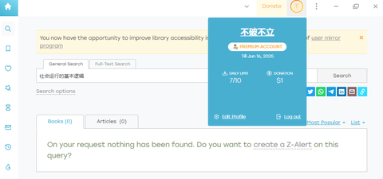
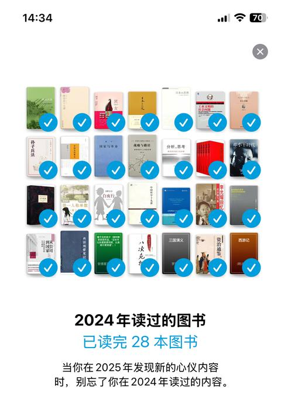
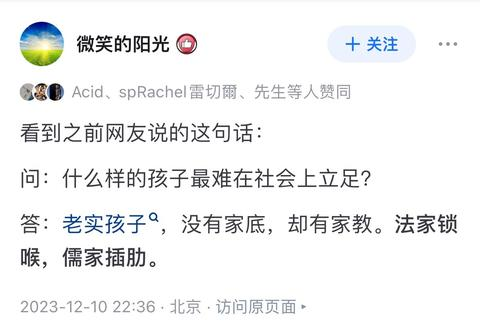
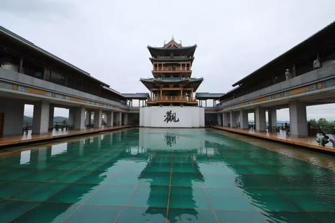
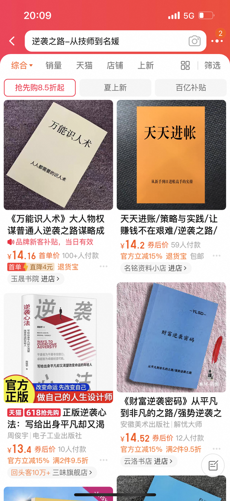

[toc]

# 问题

提问者：**<a href="https://www.zhihu.com/people/qiu-sheng-23-64">秋生</a>**
提问时间: 2022-10-12 15:41:43

为什么读书读太多反而显得傻？

# 回答

回答者： **<a href="https://www.zhihu.com/people/myf123">壹先生</a>**
回答时间: 2025-5-17 19:6:50
点赞总数: 3041
评论总数: 196
收藏总数: 11016
喜欢总数：187

有一本书叫做：《社会运行的基本逻辑》。

还有一本书叫做《潜规则应用指南》。

还有一本书叫做《低道德-通向成功之路》。

还有一本书叫做《规则破坏者-中国社会生存法则》。

还有一本书叫做《县委书记致富手册》。

还有一本书叫做《权力与财富-行贿指南》。

还有一本书叫做《权力与财富-受贿指南》。

还有一本书叫做《刮脂刀-制度设计理论基础》。

还有一本书叫做《权贵的利益-制度设计重点问题研究》。

还有一本书叫做《抄袭与剽窃-快速致富指南》。

还有一本书叫做《老赖速成手册》。

还有一本书叫做《侵权实战笔记》。

还有一本书叫做《盗版与仿制-大国崛起之路》。

还有一本书叫做《法律漏洞研究2025版》。

还有一本书叫做《交通肇事逃逸实战技巧》。

还有一本书叫做《合同诈骗实操手册》。

还有一本书叫做《财务造假修炼手册》。

还有一本书叫做《企业管理与牛马养殖》。

还有一本书叫做《顶级营销-企业家如何打造白莲花人设》。

还有一本书叫做《顶级企业必修课-过度营销与虚假宣传》。

还有一本书叫做《顶级企业必修课-高效控评技巧》。

还有一本书叫做《HR的必修课-零成本裁员》。

还有一本书叫做《高效剥削-企业生存宝典》。

还有一本书叫做《杀猪盘-当代快速致富技巧》。

还有一本书叫做《电信诈骗话术研究与应用》。

还有一本书叫做《霸凌的艺术-从校园到职场》。

还有一本书叫做《烂尾楼销售技术手册》。

还有一本书叫做《一百种占便宜的方法》。

还有一本书叫做《从零开始学装逼》。

还有一本书叫做《闪光的人性-NDP人格养成手册》。

还有一本书叫做《普通人的逆袭-从啥也不是到一无所有》。

还有一本书叫做《成为渣男的一百个好处》。

还有一本书叫做《成为捞女的一百个好处》。

还有一本书叫做《职业玩家-时间管理与多人运动研究》。

还有一本书叫做《逆袭之路-从技师到名媛》。

还有一本书叫做《婚外情实用技术》。

还有很多本呢，这些书你肯定没看过。

  

原文地址：[(壹先生)为什么读书读太多反而显得傻？](https://www.zhihu.com/question/558915362/answer/1907150073680339189) 

# 评论

1. <a href="https://www.zhihu.com/people/81-40-69-65">嗯哼</a> (<small title="广东">2025-5-18 16:17:0</small>): 你倒是发个链接呀
   - <a href="https://www.zhihu.com/people/kao-yan-xiang-shang-an-47">水中跳舞的鱼</a> (<small title="江苏">2025-5-19 1:36:52</small>): 书名就是书的内容［捂脸］
   - <a href="https://www.zhihu.com/people/zhang-xue-feng-1-10">人生难得起起落落</a> (<small title="回复于 2025-5-19 5:18:11/河北"> ✉️:水中跳舞的鱼</small>): 买了几千本书了，看过的寥寥无几［捂脸］
   - <a href="https://www.zhihu.com/people/dong-zai-heng">GoHome</a> (<small title="山东">2025-5-19 9:20:31</small>): 这些书有个汇编叫《中华人民共和国刑法》
   - <a href="https://www.zhihu.com/people/ggg-74-25-1">莎碧知乎</a> (<small title="贵州">2025-5-20 18:23:52</small>): 今天你敢看这些，明天你要做什么我都不敢想［大笑］
   - <a href="https://www.zhihu.com/people/81-40-69-65">嗯哼</a> (<small title="回复于 2025-5-21 12:55:33/广东"> ✉️:莎碧知乎</small>): 搏一搏，单车变摩托
   - <a href="https://www.zhihu.com/people/zqq-10-13">ZQQ</a> (<small title="回复于 2025-5-22 14:1:44/湖北"> ✉️:GoHome</small>): 没绷住
   - <a href="https://www.zhihu.com/people/yifen-zhong-you-61miao">momo</a> (<small title="回复于 2025-5-22 14:36:36/广东"> ✉️:GoHome</small>): 还有本书叫：《财富指南-刑法逆修》
   - <a href="https://www.zhihu.com/people/mao-ting-wang">木斋</a> (<small title="贵州">2025-5-31 21:13:56</small>): 加1
   - <a href="https://www.zhihu.com/people/jun-mo-xiao-64-49-30">君莫笑</a> (<small title="回复于 2025-6-3 9:12:41/浙江"> ✉️:水中跳舞的鱼</small>): 我被骗了［捂嘴］
   - <a href="https://www.zhihu.com/people/dong-he-nu">春风吹又生</a> (<small title="回复于 2025-6-7 12:21:27/湖南"> ✉️:GoHome</small>): 哈哈，那还得去研究下刑法，实在看不懂，就听罗老师的刑法课
   - <a href="https://www.zhihu.com/people/lily-80-17-99">沉默的羔羊</a> (<small title="回复于 2025-6-29 21:4:59/湖北"> ✉️:GoHome</small>): 笑死［感谢］哈哈哈哈哈哈，精辟。
   - <a href="https://www.zhihu.com/people/mu-yu-53-19-78">云深不识路</a> (<small title="辽宁">2025-7-1 3:55:52</small>): 哥，我学生都看懂他说的是什么意思了，你居然……
   - <a href="https://www.zhihu.com/people/yzuogao">Tsokaoyin姣童子</a> (<small title="回复于 2025-7-11 18:50:10/中国香港"> ✉️:GoHome</small>): 还是你小子懂［飙泪笑］
   - <a href="https://www.zhihu.com/people/22-89-54-73-13">知乎用户m9NFyM</a> (<small title="回复于 2025-7-27 10:41:30/湖北"> ✉️:云深不识路</small>): 恭喜你他后台向你招手了
   - <a href="https://www.zhihu.com/people/78332-7">白舟</a> (<small title="甘肃">2025-8-4 20:19:51</small>): 上链接老铁
   - <a href="https://www.zhihu.com/people/nuan-ran-fei-liang-16">红茶拿铁燕麦奶</a> (<small title="云南">2025-8-17 18:34:57</small>): 大全集上链接[https://pan.quark.cn/s/a1baf8410ebe](https://pan.quark.cn/s/a1baf8410ebe)
   - <a href="https://www.zhihu.com/people/89-70-78-95-77">离火</a> (<small title="上海">2025-8-21 20:13:5</small>): 小米不是吗 主要人家确实没什么黑料
   - <a href="https://www.zhihu.com/people/19-62-19-44">知乎用户</a> (<small title="广东">2025-11-22 12:15:40</small>): 道可道非常道
2. <a href="https://www.zhihu.com/people/lei-meng-de-31-36">立早雨田</a> (<small title="沙特阿拉伯">2025-5-19 21:59:10</small>): 《独裁者手册》（The Dictator's Handbook）  
 
作者：布鲁斯·布恩诺·德·梅斯奎塔、阿拉斯泰尔·史密斯  
 
内容简介：这本书探讨了政治领导人如何获取和维持权力，分析了政治行为的基本逻辑，适合对政治学和权力机制感兴趣的读者。  
 
  
 
《人类简史》（Sapiens: A Brief History of Humankind）  
 
作者：尤瓦尔·赫拉利  
 
内容简介：这本书从人类的起源出发，探讨了人类社会的发展历程，涉及了文化、经济、政治等多个方面，适合对人类社会演变感兴趣的读者。  
 
  
 
《影响力》（Influence: The Psychology of Persuasion）  
 
作者：罗伯特·B·西奥迪尼  
 
内容简介：这本书深入分析了人类行为的心理学原理，揭示了影响他人决策的六大原则，适合对人际关系和社会行为感兴趣的读者。  
 
  
 
《黑天鹅》（The Black Swan）  
 
作者：纳西姆·尼古拉斯·塔勒布  
 
内容简介：这本书探讨了不可预测的极端事件对世界的影响，挑战了传统的风险管理理论，适合对不确定性和风险管理感兴趣的读者。  
 
  
 
《反脆弱》（Antifragile）  
 
作者：纳西姆·尼古拉斯·塔勒布  
 
内容简介：这本书提出了“反脆弱”的概念，探讨了如何在不确定和混乱的世界中变得更强大，适合对系统思维和复杂性理论感兴趣的读者。
   - <a href="https://www.zhihu.com/people/di-wu-gong-zi-84">第五公子</a> (<small title="陕西">2025-5-20 15:15:9</small>): 你在这干嘛呢？你没看见作者在这说反话呢么。［大笑］
   - <a href="https://www.zhihu.com/people/lao-da-bu-xiao-liao-67">information gaps</a> (<small title="河南">2025-5-28 14:41:1</small>): 这里面我只看过影响力，看完之后对我来说收获颇丰
   - <a href="https://www.zhihu.com/people/ming-zhong-zhu-ding-wo-ai-ni-38">命中注定我爱你</a> (<small title="浙江">2025-6-3 18:2:39</small>): 这是大哥，［哇］
   - <a href="https://www.zhihu.com/people/wihkps">虞初</a> (<small title="广东">2025-6-17 21:28:29</small>): 最后一本感觉很好看，先插个针。
   - <a href="https://www.zhihu.com/people/zhang-nan-49-90">飘飘先生</a> (<small title="回复于 2025-7-19 14:21:34/河南"> ✉️:information gaps</small>): 那再推荐你看一下《思考，快与慢》［思考］
   - <a href="https://www.zhihu.com/people/richen-si-wei">无羡丶</a> (<small title="江西">2025-8-12 16:14:37</small>): cy
   - <a href="https://www.zhihu.com/people/cherryying-68">浩墨墨</a> (<small title="湖北">2025-8-13 16:1:35</small>): 突然发现后俩本都看过［捂脸］
   - <a href="https://www.zhihu.com/people/swap-21">Swap</a> (<small title="河北">2025-8-25 23:49:16</small>): 你好，请问一下这些书是需要从外面下载原版的吗？简中版是不是与原著有不小出入？
   - <a href="https://www.zhihu.com/people/vitalzhu">Vitto等三十多人</a> (<small title="卢森堡">2025-11-6 11:55:27</small>): 这几本破书，尤其是最后三本，明明几句话能说清楚的事，叭叭一整本，翻来覆去的车轱辘话。
   - <a href="https://www.zhihu.com/people/fei-ge-26-58">呓语</a> (<small title="回复于 2025-11-17 13:45:17/江苏"> ✉️:Vitto等三十多人</small>): 中肯的
3. <a href="https://www.zhihu.com/people/man-man-lai-11-68">骑鹤下江南</a> (<small title="山东">2025-5-18 18:12:55</small>): 看完前几本就知道不可能有这书
   - <a href="https://www.zhihu.com/people/zhang-mu-bai-95">张慕白</a> (<small title="山西">2025-5-19 9:47:34</small>): 换个名字就能出版
   - <a href="https://www.zhihu.com/people/meng-min-ran">长沙李大志</a> (<small title="湖南">2025-5-19 13:50:25</small>): 我还特意去搜索了一下，确实没有
   - <a href="https://www.zhihu.com/people/zhi-cheng-21-83">至诚</a> (<small title="回复于 2025-5-20 19:33:43/湖南"> ✉️:张慕白</small>): 比如《反欺骗的艺术》［捂脸］
   - <a href="https://www.zhihu.com/people/hu-shi-61">北野寂</a> (<small title="回复于 2025-5-22 10:4:12/安徽"> ✉️:至诚</small>): 还有Christopher Hadnagy写的三本关于社会工程学的书
   - <a href="https://www.zhihu.com/people/dong-he-nu">春风吹又生</a> (<small title="回复于 2025-6-7 12:22:5/湖南"> ✉️:长沙李大志</small>): 你好实诚
   - <a href="https://www.zhihu.com/people/haiwaimao">Ai课程</a> (<small title="安徽">2025-8-31 0:13:9</small>): 顶级营销，顶级企业那三本书，说的不就是常上热搜的嘛，你以为他们不知道你在说谁啊。［惊喜］
4. <a href="https://www.zhihu.com/people/81-69-69-23-53">亚力士少德</a> (<small title="天津">2025-5-18 14:34:0</small>): 收藏了，都是正经好书
   - <a href="https://www.zhihu.com/people/86-48-66-37">沐霖</a> (<small title="河南">2025-5-18 15:38:36</small>): 我也是［惊喜］［惊喜］［惊喜］
   - <a href="https://www.zhihu.com/people/chen-lan-91-2-43">辰蓝</a> (<small title="江苏">2025-5-18 18:34:53</small>): 收藏也没用，万一被删了，就没了
   - <a href="https://www.zhihu.com/people/xin-ze-42-80">方鸿渐</a> (<small title="回复于 2025-5-18 21:27:49/河南"> ✉️:辰蓝</small>): ［微笑］［微笑］［微笑］ 666
   - <a href="https://www.zhihu.com/people/zzbu-zheng-que-51">beyond</a> (<small title="上海">2025-5-19 12:2:30</small>): 截图
   - <a href="https://www.zhihu.com/people/you-da-ren-14">momo</a> (<small title="回复于 2025-5-21 16:29:54/辽宁"> ✉️:辰蓝</small>): 下班就复制到文档里去了 ［飙泪笑］
   - <a href="https://www.zhihu.com/people/qing-qing-qing-98-61">青青青</a> (<small title="安徽">2025-7-24 12:2:45</small>): 确实是好书，看完书名就看完内容的书
5. <a href="https://www.zhihu.com/people/yao-ze-yun-3">品牌策划姚老师</a> (<small title="广东">2025-5-19 15:30:5</small>): 还真有类似的东西，在网上被称为《天涯神贴》
   - <a href="https://www.zhihu.com/people/enrica-shi">落叶刺客</a> (<small title="湖北">2025-8-14 10:33:50</small>): 天涯挂了之后人人都说自己是天涯，如果再做成视频，用上许亚军的声音，那无疑就是天涯本尊了［大笑］
   - <a href="https://www.zhihu.com/people/ren-zhi-chu-22-82">人之初</a> (<small title="回复于 2025-11-21 15:46:19/广东"> ✉️:落叶刺客</small>): ［doge］全是网盘推广，狗der阿里
6. <a href="https://www.zhihu.com/people/ma-wen-15-80">咱妈</a> (<small title="山东">2025-5-18 21:28:28</small>): 找不到书，但是每个书名都是“思路”
   - <a href="https://www.zhihu.com/people/hu-shi-61">北野寂</a> (<small title="安徽">2025-5-22 9:42:15</small>): 第一本书有类似的，《国家与生活机遇：中国城市中的再分配与分层（1949-1994） 》《权力及其伪装\_关于政治的人类学视角》、第二本是吴思的《潜规则》
   - <a href="https://www.zhihu.com/people/hu-shi-61">北野寂</a> (<small title="安徽">2025-5-22 9:45:44</small>): 第五本，不是很相关的，《县委书记们的主政谋略》
   - <a href="https://www.zhihu.com/people/hu-shi-61">北野寂</a> (<small title="安徽">2025-5-22 9:46:49</small>): 第三本，《缺德学》
   - <a href="https://www.zhihu.com/people/hu-shi-61">北野寂</a> (<small title="安徽">2025-5-22 9:51:46</small>): 倒数第五《红丸觉醒》，不过写的不怎么好
   - <a href="https://www.zhihu.com/people/aflyeaglenku">aflyeaglenku</a> (<small title="回复于 2025-6-5 12:49:56/陕西"> ✉️:北野寂</small>): 现在都论艺术了，缺德的力量，缺德的艺术，缺德：从入门到精通，
   - <a href="https://www.zhihu.com/people/li-yu-sen-38">胶粘技术-Yuson</a> (<small title="回复于 2025-6-10 14:30:7/广东"> ✉️:北野寂</small>): 厚黑学
7. <a href="https://www.zhihu.com/people/svcz-97">知乎用户rs3TRO</a> (<small title="湖北">2025-5-18 16:24:17</small>): 你倒是给个链接啊！
   - <a href="https://www.zhihu.com/people/lan-xiao-ye-2">蓝小野</a> (<small title="湖北">2025-5-21 11:22:4</small>): 《刑法》
8. <a href="https://www.zhihu.com/people/tang-tang-xiao-ba-wang-82">玩家</a> (<small title="江苏">2025-5-18 17:31:11</small>): 我说真的 这些玩意要写出来了 整体素质提高那么多 岂不是游戏更难玩了？
   - <a href="https://www.zhihu.com/people/ming-wei-zhi-35">摔倒爬起天天向上</a> (<small title="福建">2025-5-19 12:42:56</small>): 会相对公平。贫富悬殊本质是生产资料占有问题。在于信息差。  
 
马克思讲过火药打破了封建庄园主的城堡和盔甲
   - <a href="https://www.zhihu.com/people/cang-hai-14-20-45">桑田</a> (<small title="广东">2025-7-2 11:2:57</small>): 反过来看，这些书好用的原因之一，就是儒家插肋［doge］
9. <a href="https://www.zhihu.com/people/chen-jia-jia-41-83">爆炒区块链</a> (<small title="上海">2025-5-18 19:30:22</small>): 看书名就知道是正经书［大笑］
10. <a href="https://www.zhihu.com/people/xiao-bai-tu-ya-xiao-bai-tu">知乎用户9EbY9e</a> (<small title="日本">2025-6-1 9:56:13</small>): 我只看《娶富婆指南》
11. <a href="https://www.zhihu.com/people/pa-ge-diao">勇敢的心</a> (<small title="湖北">2025-6-20 17:55:31</small>): 一直想写这样一套丛书，现在这大纲，不就有了
    - **壹先生** (<small title="北京">2025-6-20 19:59:48</small>): ［感谢］
12. <a href="https://www.zhihu.com/people/33-94-82-57">筚路蓝缕</a> (<small title="河北">2025-5-20 18:1:49</small>): 原来是读错书了。［捂脸］
13. <a href="https://www.zhihu.com/people/newsoul-82">twkkkkk</a> (<small title="湖北">2025-5-18 18:16:32</small>): 读书只能把你培养成工程师，高级打工人，如果工程师水平差，可能和工厂普工差不多
14. <a href="https://www.zhihu.com/people/lj5469">知者乎者知乎者</a> (<small title="北京">2025-5-19 8:37:53</small>): 《烂尾楼销售技术手册》在哪看
15. <a href="https://www.zhihu.com/people/jin-wan-da-lao-hu-24-14-75">今晚打老虎</a> (<small title="浙江">2025-9-10 23:21:11</small>): 看到最后一本书的时候我决定收藏这篇文章
16. <a href="https://www.zhihu.com/people/richard.t">図生</a> (<small title="江苏">2025-8-27 16:58:4</small>): 我替大家检索了，么有这些，只是代指这些方面的知识
17. <a href="https://www.zhihu.com/people/xiao-bai-dou-fu-3">小白豆腐</a> (<small title="河南">2025-6-25 22:57:44</small>): 赞
    - **壹先生** (<small title="北京">2025-6-25 23:22:4</small>): ［感谢］
18. <a href="https://www.zhihu.com/people/guo-zhong-ming-21">择摘者</a> (<small title="安徽">2025-7-27 20:27:33</small>): 这些书和世面上的成功学鸡汤一样，看似给大家带来对于某些社会规则的介绍和方法，可实际上只是把人放到巨大的哈哈镜里面，看着扭曲的自己以为是真实的自己［吃瓜］
19. <a href="https://www.zhihu.com/people/nathanliu">wavefly</a> (<small title="浙江">2025-5-18 18:59:28</small>): 你倒是放个网盘啊［酷］
20. <a href="https://www.zhihu.com/people/debbie-61-79">debbie</a> (<small title="新疆">2025-5-18 19:41:40</small>): ［捂脸］小编你这是不走寻常路啊
21. <a href="https://www.zhihu.com/people/35-76-33-37-32">知乎用户a3Rkws</a> (<small title="山东">2025-5-19 10:32:52</small>): 我甚至还上Z-lib上搜了［尴尬］
    - <a href="https://www.zhihu.com/people/da-ji-ji-6-90">大吉吉</a> (<small title="广东">2025-5-19 15:50:41</small>): 真搜了就符合提问了［捂脸］
    - <a href="https://www.zhihu.com/people/35-76-33-37-32">知乎用户a3Rkws</a> (<small title="回复于 2025-5-19 15:58:43/山东"> ✉️:大吉吉</small>): 请忽略我捐的1刀，毕竟穷
 

    - <a href="https://www.zhihu.com/people/nature-synthesis">Leak</a> (<small title="回复于 2025-5-20 11:43:57/湖南"> ✉️:知乎用户a3Rkws</small>): 倒是有一本书 世界的逻辑
    - <a href="https://www.zhihu.com/people/35-76-33-37-32">知乎用户a3Rkws</a> (<small title="回复于 2025-5-20 12:35:1/山东"> ✉️:Leak</small>): 谢谢［握手］
22. <a href="https://www.zhihu.com/people/ai-xin-jue-luo-yi-ding">爱新觉罗一丁</a> (<small title="浙江">2025-5-19 18:13:20</small>): 家里蹲大学 社会系 坑蒙拐骗专业的专业书籍书籍
23. <a href="https://www.zhihu.com/people/feng-tu-nan-44">LOGOS</a> (<small title="陕西">2025-5-18 22:8:27</small>): 这些书看了人会废掉的
    - <a href="https://www.zhihu.com/people/xzlx-6">xzlx</a> (<small title="浙江">2025-5-19 4:57:26</small>): 那说明没看完，没看透
24. <a href="https://www.zhihu.com/people/jim-3-55-77">jim</a> (<small title="北京">2025-5-28 0:43:12</small>): 总结一下就是法家那一套，势术法，仗势欺人，阴谋诡计，两面三刀
25. <a href="https://www.zhihu.com/people/lw-00-11">猛鬼山</a> (<small title="山西">2025-5-21 15:40:37</small>): 好书名，从书名就知道这样写书绝对有读者。
 
我决定开写这些书［感谢］
    - **壹先生** (<small title="北京">2025-5-21 16:2:4</small>): ［感谢］
26. <a href="https://www.zhihu.com/people/xue-zhe-58-66-3">常年在放牛</a> (<small title="江苏">2025-5-21 15:7:47</small>): 都是社会大学必修课啊，老赖速成肯定是选修
    - **壹先生** (<small title="北京">2025-5-21 16:2:9</small>): ［感谢］
27. <a href="https://www.zhihu.com/people/dao-shou-25">知乎用户sZPSQl</a> (<small title="四川">2025-5-19 17:24:46</small>): 我还一本正经的把书名保存起来，准备慢慢欣赏［飙泪笑］［飙泪笑］［飙泪笑］
28. <a href="https://www.zhihu.com/people/cheng-ya-jing-66">AlexChan</a> (<small title="河北">2025-5-19 4:26:52</small>): 其实一本就够了 被文盲+流氓们奉为圭臬的《厚黑学》
    - <a href="https://www.zhihu.com/people/zzbu-zheng-que-51">beyond</a> (<small title="上海">2025-5-19 12:4:0</small>): 厚黑学书很理论化 缺乏实操指导 迁移到现实中得学很久
29. <a href="https://www.zhihu.com/people/chu-men-61-4">大红薯</a> (<small title="福建">2025-5-24 14:55:47</small>): 连续看书几年了。这是去年24年翻的书，其中《资治通鉴》看的是白话文版本。体会如下，1；大多是时候对于看过的书基本没有记忆。2、与陌生人初次沟通三分钟内，大多数对方会注意到与人不同的地方（自我猜测应该是表达的字句措辞有些不同）。3、逻辑性会比之前更强些。以上 
30. <a href="https://www.zhihu.com/people/xuanweice">永泉谈个der</a> (<small title="福建">2025-5-19 17:36:58</small>): 这么跟你说吧，这些书全是水书，就是你看着有用，实际上没有任何用处，而且你读完后还会一阵恶心［笑哭］［笑哭］［笑哭］
31. <a href="https://www.zhihu.com/people/wang-xian-sen-10-59">一只作文喵</a> (<small title="江苏">2025-5-19 9:31:16</small>): 好讽刺。
32. <a href="https://www.zhihu.com/people/xiao-wen-cang-tian-tian-mo-ran">笑问苍天天默然</a> (<small title="广东">2025-6-3 14:32:1</small>): 有些人，犯法了，却不犯法。有些人犯法了，就是犯法了。人与人其实不是一样的。跟着大佬玩，想着成为大佬，你的末日就到了。。。这就是生存法则。跟法律无关。
33. <a href="https://www.zhihu.com/people/cang-hai-14-20-45">桑田</a> (<small title="广东">2025-5-20 20:21:3</small>): 书名前面全部加个【反】就差不多都能出版了［doge］
34. <a href="https://www.zhihu.com/people/ccx-45">五庄镇元巨神兵</a> (<small title="浙江">2025-5-19 11:5:31</small>): 十万火急赶快出版！盗版也行，我们真的太需要了。［大哭］
35. <a href="https://www.zhihu.com/people/jing-ke-ci-qin-wang-79-87">荆轲刺秦王</a> (<small title="云南">2025-5-18 20:5:23</small>): 我还以为你要说“这些书都没有，是我编的”［惊喜］
36. <a href="https://www.zhihu.com/people/90-78-9-52">海海</a> (<small title="广东">2025-5-18 17:55:24</small>): 有才兄，我终于找到你了
37. <a href="https://www.zhihu.com/people/gui-hua-di">望周知</a> (<small title="北京">2025-5-18 20:45:28</small>): 第一天收到书，第二天条子就到你家门口
38. <a href="https://www.zhihu.com/people/frank-li-46-69">Frank Li</a> (<small title="湖南">2025-11-21 17:43:2</small>): 教练，我就要学这些。［酷］［酷］［酷］
39. <a href="https://www.zhihu.com/people/chen-tao-yuan-98">福瑞</a> (<small title="黑龙江">2025-11-21 10:34:37</small>): 光看名字我感觉整个人都变坏了
40. <a href="https://www.zhihu.com/people/mu-yu-xiao-xiao-wen-zi-gui-23">暮雨潇潇闻子规</a> (<small title="江西">2025-11-21 14:35:49</small>): 邪修是吧［吃瓜］
41. <a href="https://www.zhihu.com/people/peng-zhi-feng-98">我的昵称和你一样</a> (<small title="广东">2025-11-21 11:55:26</small>): 那不是，，，，人妻约会指南，还是看过的。
42. <a href="https://www.zhihu.com/people/wang-ji-qiong-94-8">新罗将军玉素甫</a> (<small title="北京">2025-11-20 11:38:34</small>): 这些书加起来没有一本《吹牛逼大全》来的实在
43. <a href="https://www.zhihu.com/people/80-64-91-48-27">NEKGod</a> (<small title="北美地区">2025-11-19 18:0:17</small>): 闪光的人性-NDP人格养成手册 这啥书？
44. <a href="https://www.zhihu.com/people/ni-ke-66-81">倪峇</a> (<small title="广东">2025-11-19 10:25:42</small>): 这些不是韦小宝的成功经验录［爱］
45. <a href="https://www.zhihu.com/people/chang-xiao-zhu-93-86">共识流通处</a> (<small title="上海">2025-11-18 19:14:18</small>): 
46. <a href="https://www.zhihu.com/people/shi-yi-49-33-10">深蓝</a> (<small title="广东">2025-11-16 18:36:23</small>): 知行要合一，不能读死书
47. <a href="https://www.zhihu.com/people/ren-zao-ren-98">人造人loading</a> (<small title="河北">2025-11-16 15:23:16</small>): 人才啊
48. <a href="https://www.zhihu.com/people/67-95-95-94-56">怪怪松</a> (<small title="河南">2025-11-14 11:54:31</small>): 其实这些都需要实践，看书没有用［捂脸］
49. <a href="https://www.zhihu.com/people/d-36-9-9">科技知多D</a> (<small title="广东">2025-11-11 11:28:42</small>): 哈哈哈哈要是有链接推上来，［发呆］
50. <a href="https://www.zhihu.com/people/qiu-sha-yu-45">秋沙雨</a> (<small title="山东">2025-11-11 13:34:1</small>): 最近还有个《人妻约会指南》
51. <a href="https://www.zhihu.com/people/qiu-yi-85-73">时光之岸</a> (<small title="河南">2025-11-8 22:31:5</small>): 惊出一身冷汗，原来是裸奔［思考］。  
 
这广告语把别人当傻子了。  
 
没有什么感同身受，不过是一厢情愿罢了
52. <a href="https://www.zhihu.com/people/yin-ke-24-13">银客</a> (<small title="江苏">2025-11-7 11:5:1</small>): 其实就是说，不管书也好论坛也好，很多观点有两面性，你觉得有道理可能都会相信，最后会失去主观思想。人要有自洽的三观，读适合自己的书，认可自己思考过相信的观点。
53. <a href="https://www.zhihu.com/people/bachao-73">深夜空想家</a> (<small title="江苏">2025-11-4 23:28:22</small>): 这些书看了真的有用吗？能够提高自己的认知和口才吗？真的非常需要。［飙泪笑］［飙泪笑］
54. <a href="https://www.zhihu.com/people/wang-luo-hu-li">网络狐狸</a> (<small title="重庆">2025-11-4 9:3:16</small>): “读”不完，根本读不完
55. <a href="https://www.zhihu.com/people/dataidea">知乎用户uewVPu</a> (<small title="广东">2025-11-4 0:50:30</small>): 倒不如一本《投胎指南》
56. <a href="https://www.zhihu.com/people/jin-guang-zhao-ren-jian">一间杂货店</a> (<small title="广东">2025-10-31 1:14:49</small>): 天涯贴
57. <a href="https://www.zhihu.com/people/ju-guang-deng-wa-wa">聚光灯娃娃</a> (<small title="四川">2025-10-29 15:49:41</small>): ［大笑］［赞］人才，这就是读书读得多的“后遗症”
58. <a href="https://www.zhihu.com/people/zhou-min-27-81-82">一叶扁舟</a> (<small title="江西">2025-10-13 16:56:35</small>): 这是作者意想的爽文，无所不能的主人翁。
59. <a href="https://www.zhihu.com/people/lanceleefeng">lance</a> (<small title="河南">2025-10-5 9:11:19</small>): 最大的问题什么，是这些其实跟学技术学艺术一样，吃天分。
 
学不来就是学不来。
 
不是因为不知道，而是知道了看了也不会用，也没机会用。
 
[［吃瓜］](https://picx.zhimg.com/v2-db92f653a2ec17ea3ff309d6d56e8507.gif?source=1d2f5c51)
60. <a href="https://www.zhihu.com/people/92-10-95-67">割王总剁主</a> (<small title="江苏">2025-9-8 15:39:9</small>): ［赞同］［赞同］［赞同］［赞同］
61. <a href="https://www.zhihu.com/people/ruh55l">起床山人</a> (<small title="河南">2025-8-26 11:33:13</small>): 这些书你们都找到了吗
62. <a href="https://www.zhihu.com/people/xiao-zhu-13-63-12">晓宁</a> (<small title="四川">2025-8-22 16:43:2</small>): 太吓人了
63. <a href="https://www.zhihu.com/people/95-85-96-6">生命周期抗体</a> (<small title="浙江">2025-8-16 1:28:31</small>): hh
64. <a href="https://www.zhihu.com/people/65-47-19-18-30">Parzival Sanchez</a> (<small title="山东">2025-8-14 13:44:46</small>): 别说，你还真别说，我挺想看看《从零开始学装逼》的
65. <a href="https://www.zhihu.com/people/andersin">你叫什么名字</a> (<small title="四川">2025-8-14 11:45:18</small>): 没有《全国富婆通讯录》这本书，差评
66. <a href="https://www.zhihu.com/people/xian-sheng-yu-mao-37">荣正直</a> (<small title="河南">2025-8-14 17:11:18</small>): 知道为什么读书无用吗 因为你读的全都是八股文 有句话叫半部论语治天下 其实是骗你的 而是半部论语制天下 控制的制 你看的历史是被篡改了的历史 你看的各种信息都是被进行阉割删除了的 你读的书只是别人用来控制你的思想工具 而你却奉为圭臬 而真正有用的书是被垄断的 只能内部阅读 被垄断阶级牢牢攥在手中
67. <a href="https://www.zhihu.com/people/shi-zai-ren-wei-78-38">明月</a> (<small title="广东">2025-8-2 10:37:18</small>): 这篇回答用反讽文学解构“读书无用论”，堪称当代《儒林外史》——  
 
  
 
核心手法  
 
  
 
作者虚构25本“黑色书名”（如《潜规则应用指南》《法律漏洞研究2025》），表面列书单，实则映射现实社会的灰色生存法则：  
 
  
 
\- 《刮脂刀》暗喻制度剥削；  
 
\- 《零成本裁员》讽刺职场无情；  
 
\- 《烂尾楼销售手册》直击地产乱象……点睛句：“这些书你肯定没看过”——暗示“傻”源于坚守道德，而非真无知。  
 
  
 
深层批判  
 
  
 
1. 撕破“成功学”假面：将“钻漏洞”“造假”“剥削”等行为包装成“指南”，揭露功利主义对知识的扭曲；  
 
2. 为读书人正名：“显得傻”是因拒绝同流合污（如不行贿、不诈骗），反衬坚守底线的稀缺性；  
 
3. 反讽最高境界：全文无一句直接批判，却让读者从书名中自动解码出道德困境（例：《受贿指南》与《行贿指南》并列，暗示腐败闭环）。  
 
  
 
荒诞中的真相  
 
  
 
当《侵权实战笔记》成为“必读书”，  
 
《闪光的人性》反而沦为“无用之书”——  
 
不是读书人傻，是扭曲的规则让清醒者显得格格不入。  
 
总结：全文如一把包裹幽默糖衣的社会手术刀，剖开“读书无用论”的虚妄——让人显傻的从来不是知识，而是浑浊环境中那份不肯妥协的清醒。  
 
［不抬杠］［不抬杠］［不抬杠］［不抬杠］［不抬杠］［不抬杠］［不抬杠］［不抬杠］［不抬杠］［不抬杠］［不抬杠］
68. <a href="https://www.zhihu.com/people/yao-zhi-zhu-17">望岳</a> (<small title="福建">2025-7-14 18:27:28</small>): 为什么就财务造价修炼手册是蓝色的。［看看你］
69. <a href="https://www.zhihu.com/people/6-92-28-28-40">风语者</a> (<small title="广东">2025-7-9 16:53:58</small>): 你说的读书是上学受教育，不是广义的读书汲取知识
70. <a href="https://www.zhihu.com/people/liu-bang-26-69">王振邦</a> (<small title="河北">2025-7-4 23:43:29</small>): 没有这些书啊？
71. <a href="https://www.zhihu.com/people/47-5-70-73">北陆</a> (<small title="江苏">2025-7-2 3:38:52</small>): 作者举例子是想说明读书读的多的人变呆，不是因为读书多，而是因为书的内容吗？
72. <a href="https://www.zhihu.com/people/25-17-7-16">kzd001</a> (<small title="四川">2025-6-30 1:40:8</small>): 考虑到河蟹，我去zlib搜了一下，确实没有。
    - <a href="https://www.zhihu.com/people/25-17-7-16">kzd001</a> (<small title="四川">2025-6-30 1:40:41</small>): 完了，我好像和问题相呼应了
73. <a href="https://www.zhihu.com/people/56-41-60-36-21">孔四维</a> (<small title="浙江">2025-6-23 16:30:39</small>): 看头两个就知道，坏了，这是遇到行家了啊［doge］
74. <a href="https://www.zhihu.com/people/97-67-11-45">芝士青年</a> (<small title="云南">2025-6-21 11:40:21</small>): 婚外情实用技术，这个书主要讲什么
75. <a href="https://www.zhihu.com/people/59-42-49-80-41">小乎质量不行了</a> (<small title="广东">2025-6-9 22:44:57</small>): 有这些书吗?
76. <a href="https://www.zhihu.com/people/wei-ni-xie-shi-89-23">跨境小知识</a> (<small title="广东">2025-6-9 13:12:5</small>): 这些书就跟你拿着几千块的工资，学着霸道总裁怎么收购敌对势力一样［捂脸］
77. <a href="https://www.zhihu.com/people/3332-3">3332</a> (<small title="河南">2025-5-28 17:42:41</small>): 书和现实选择一个。我选择现实。
78. <a href="https://www.zhihu.com/people/zhao-yun-fei-53-68">赵云飞</a> (<small title="北京">2025-5-26 13:34:29</small>): 看书得动脑子，动脑子的就不傻
79. <a href="https://www.zhihu.com/people/guo-dong-61-58">思索者</a> (<small title="湖南">2025-5-25 8:31:51</small>): 倒数第三本我看过，著名作家罗志祥
80. <a href="https://www.zhihu.com/people/mei-hao-ren-sheng-12-79">星辰</a> (<small title="山东">2025-5-21 18:4:44</small>): 怎么找怎么找
81. <a href="https://www.zhihu.com/people/le-jia-57-31">论随机性</a> (<small title="湖南">2025-5-22 1:0:6</small>): 看上去很冲突，实际上，都读懂才能真正的办好事，毕竟精通别人的做法才能防止出事情
82. <a href="https://www.zhihu.com/people/su-yi-xuan-xi-75">lexJZC</a> (<small title="福建">2025-5-21 20:27:36</small>): 因为问题的关键是实践
83. <a href="https://www.zhihu.com/people/chen-zi-cai-90">投机future</a> (<small title="广东">2025-5-21 20:14:48</small>): 佩服佩服
84. <a href="https://www.zhihu.com/people/ni-ke-68-94">鬼方</a> (<small title="浙江">2025-5-21 22:12:1</small>): 没啥用 不如看看合同 法律 或者学一门编程语言
85. <a href="https://www.zhihu.com/people/mei-hao-ren-sheng-12-79">星辰</a> (<small title="山东">2025-5-21 18:4:17</small>): 书在哪里找啊
86. <a href="https://www.zhihu.com/people/ggg-74-25-1">莎碧知乎</a> (<small title="贵州">2025-5-20 18:24:48</small>): 今天你敢看这些，明天你要做什么我都不敢想［大笑］
87. <a href="https://www.zhihu.com/people/zhi-cheng-21-83">至诚</a> (<small title="湖南">2025-5-20 19:33:9</small>): 我只需要一本《刑法》和一本《刑法学》［捂脸］
88. <a href="https://www.zhihu.com/people/shan-shuo-51-21">闪烁</a> (<small title="河南">2025-5-20 10:48:32</small>): 谁能翻译翻译书名啊？
89. <a href="https://www.zhihu.com/people/gan-qiu-feng-93">禾禾</a> (<small title="广东">2025-5-20 19:20:47</small>): ［感谢］［感谢］
90. <a href="https://www.zhihu.com/people/yang-zi-ping-41-52">momo</a> (<small title="上海">2025-5-19 13:57:57</small>): 这才是让中国青年少走几年弯路的人生导师［酷］
91. <a href="https://www.zhihu.com/people/shenzhen2015">Mr.P</a> (<small title="广东">2025-5-19 10:24:22</small>): 最后一本给个链接呗哥
92. <a href="https://www.zhihu.com/people/zhan-mu-si-lian-yu-jia">詹姆斯练瑜伽</a> (<small title="浙江">2025-5-19 12:28:31</small>): 还得学点法律
93. <a href="https://www.zhihu.com/people/yunyu647">且看九州同</a> (<small title="内蒙古">2025-5-19 9:59:28</small>): 没有的话自己写呗［doge］
94. <a href="https://www.zhihu.com/people/a-la-17-7-10">阿拉</a> (<small title="云南">2025-5-19 10:6:43</small>): ［感谢］［感谢］
95. <a href="https://www.zhihu.com/people/lan-ji-66-99">肆无</a> (<small title="湖南">2025-5-19 9:45:50</small>): 这书好，这书简直太好了，谁说读书不好啊
96. <a href="https://www.zhihu.com/people/mo-yi-64-8">莫易</a> (<small title="天津">2025-5-19 9:5:3</small>): 《说谎的艺术》，《你为什么脸皮薄？》
97. <a href="https://www.zhihu.com/people/89456-27">知乎用户89456</a> (<small title="湖北">2025-5-19 8:22:46</small>): 能不能AI还原一下内容
98. <a href="https://www.zhihu.com/people/ou-xuan-ling">好水告</a> (<small title="广东">2025-5-19 13:18:39</small>): 但凡能搜到一本也好啊［飙泪笑］
99. <a href="https://www.zhihu.com/people/17-37-47-25-14">逍遥之游</a> (<small title="河北">2025-5-19 12:25:37</small>): 快写［生气］
100. <a href="https://www.zhihu.com/people/yu-chao-jie-55">陆虚冥</a> (<small title="上海">2025-5-19 9:53:54</small>): 赶紧出版
101. <a href="https://www.zhihu.com/people/zui-mei-bu-guo-cha-na-46">最美不过刹那</a> (<small title="山东">2025-5-19 9:40:56</small>): 条条大路通罗马，出了社会才发现原来挣钱可以有一千种办法，最简单和轻松的就是你有资源有人脉有信息，都没有？慢慢接触慢慢攒吧
102. <a href="https://www.zhihu.com/people/zhangyuanchun">薛定猫的鳄</a> (<small title="广东">2025-5-19 0:10:43</small>): ［大笑］你倒是给个后三本的链接啊
103. <a href="https://www.zhihu.com/people/zhe-gua-bao-shou-99-49">亚伦.布什内尔</a> (<small title="浙江">2025-5-19 0:15:50</small>): 首先，肯定没有这些书，但是，光看标题就知道真相了，给答主一个大大的赞👍🏻
104. <a href="https://www.zhihu.com/people/cheng-zi-41-11-86">日月宫使浪味仙</a> (<small title="湖南">2025-5-18 20:10:13</small>): 我只看到这个
 

     - <a href="https://www.zhihu.com/people/mu-ming-li-de-nan-ju-hua">啊木</a> (<small title="云南">2025-5-20 1:24:43</small>): 你不去闲鱼看？
105. <a href="https://www.zhihu.com/people/lu-xun-2-82">鲁迅</a> (<small title="广东">2025-5-19 9:7:41</small>): ［爱］
106. <a href="https://www.zhihu.com/people/yundian-94">喵师傅</a> (<small title="北京">2025-5-19 11:0:44</small>): “我要是在你这学成了 那我zou成绑票的了”
107. <a href="https://www.zhihu.com/people/niu-yi-qun-47">赛博神父</a> (<small title="河北">2025-5-18 19:4:53</small>): 给个链接啊［蹲］
108. <a href="https://www.zhihu.com/people/cang-hai-ying-xue-65">沧海映雪</a> (<small title="上海">2025-5-19 11:16:8</small>): 收藏了，很多人的底层逻辑和从小受到的教育跟普通人就是不一样的，家学渊源，博采众长。［大笑］
109. <a href="https://www.zhihu.com/people/7hlor4">小老窝</a> (<small title="安徽">2025-5-18 21:53:58</small>): 这些都是真理啊
110. <a href="https://www.zhihu.com/people/qing-feng-wu-hen-no1">清风无痕NO1</a> (<small title="辽宁">2025-5-19 11:20:34</small>): 求链
111. <a href="https://www.zhihu.com/people/74-44-25-32-34">谎言与愤怒</a> (<small title="广东">2025-5-19 8:57:20</small>): 如果人心都是这样，那么天堂也会变成地狱
112. <a href="https://www.zhihu.com/people/chen-jia-84">陈佳</a> (<small title="柬埔寨">2025-5-18 22:53:10</small>): 我一本都没有看过［哇］
113. <a href="https://www.zhihu.com/people/ren-long-44-82">不要队友我能九杀</a> (<small title="上海">2025-5-19 1:13:27</small>): 社会大学内部书籍，很贵的，一般人看不到，更别说学会了［感谢］
114. <a href="https://www.zhihu.com/people/zi-jian-76-41-85">子健</a> (<small title="湖南">2025-5-18 23:23:22</small>): ［生气］［生气］
115. <a href="https://www.zhihu.com/people/juefan-luo">路人旅</a> (<small title="云南">2025-5-19 7:56:40</small>): 编撰大部分书名是某本成功学的课后练习［机智］
116. <a href="https://www.zhihu.com/people/ztyyy-49">ztyyy</a> (<small title="广东">2025-5-18 22:50:21</small>): 歪门邪道
     - <a href="https://www.zhihu.com/people/moat-60">知乎用户</a> (<small title="广东">2025-5-25 0:27:22</small>): 实用之道
117. <a href="https://www.zhihu.com/people/du-fu-51-19">江右狂夫</a> (<small title="韩国">2025-5-18 22:11:31</small>): 全是旁门左道
118. <a href="https://www.zhihu.com/people/ceng-xiang-78-4">艾叔</a> (<small title="重庆">2025-5-18 20:45:52</small>): ［捂脸］［捂脸］［捂脸］好多书啊
119. <a href="https://www.zhihu.com/people/xi-men-chui-feng-20-90">西门吹风</a> (<small title="云南">2025-5-18 16:48:54</small>): 没有这书啊搜不到
120. <a href="https://www.zhihu.com/people/shan-zhong-you-yu">河了西了</a> (<small title="云南">2025-5-18 18:5:18</small>): ［撇嘴］一本都找不到
121. <a href="https://www.zhihu.com/people/hhhhg-63">阿拉丁的冰糖橙</a> (<small title="湖北">2025-5-18 17:54:15</small>): 哈哈，书名是真书名被换名字的总结
122. <a href="https://www.zhihu.com/people/jiao-shou-51-73">教授12355</a> (<small title="河南">2025-5-18 21:17:12</small>): 这…
 
应该是好书，可都能查到吗？
123. <a href="https://www.zhihu.com/people/tong-tong-tong-71">金尊马</a> (<small title="内蒙古">2025-5-18 21:32:28</small>): 这些书都没有👎哈哈
124. <a href="https://www.zhihu.com/people/huang-tong-xue-46-68">Wong</a> (<small title="广东">2025-5-18 17:24:42</small>): 潜规则能写成书？能写成书的不就成明规则了吗［惊喜］
125. <a href="https://www.zhihu.com/people/huang-he-72-41">蹦哒</a> (<small title="宁夏">2025-5-18 18:11:51</small>): 链接发我
126. <a href="https://www.zhihu.com/people/hu-bo-14-34">布烦</a> (<small title="重庆">2025-5-18 17:39:3</small>): 没找到［语塞］
127. <a href="https://www.zhihu.com/people/qi-zi-fei-55">银枪白马吕小布</a> (<small title="山东">2025-5-18 18:17:18</small>): 最后一本我想看
128. <a href="https://www.zhihu.com/people/px3316">钟九思</a> (<small title="广东">2025-5-30 11:7:13</small>): 我真的傻不愣登的去百度搜了一下，人蠢没得医啊。［笑哭］［大哭］［大哭］
129. <a href="https://www.zhihu.com/people/huzhenting">David看周期</a> (<small title="上海">2025-11-22 8:0:19</small>): 儒家洗脑
 
眼神清澈的像大学生
 
这就是典型的读书
130. <a href="https://www.zhihu.com/people/gou-dan-er-68-85">狗蛋儿</a> (<small title="四川">2025-7-4 1:33:22</small>): 真有这些书吗？你编的书名？

=[评论](./attachments/comments.json)

