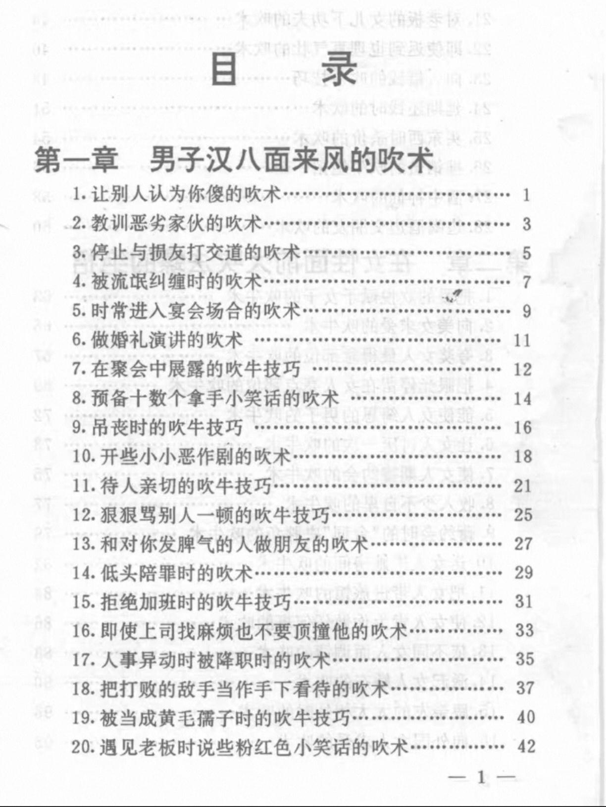
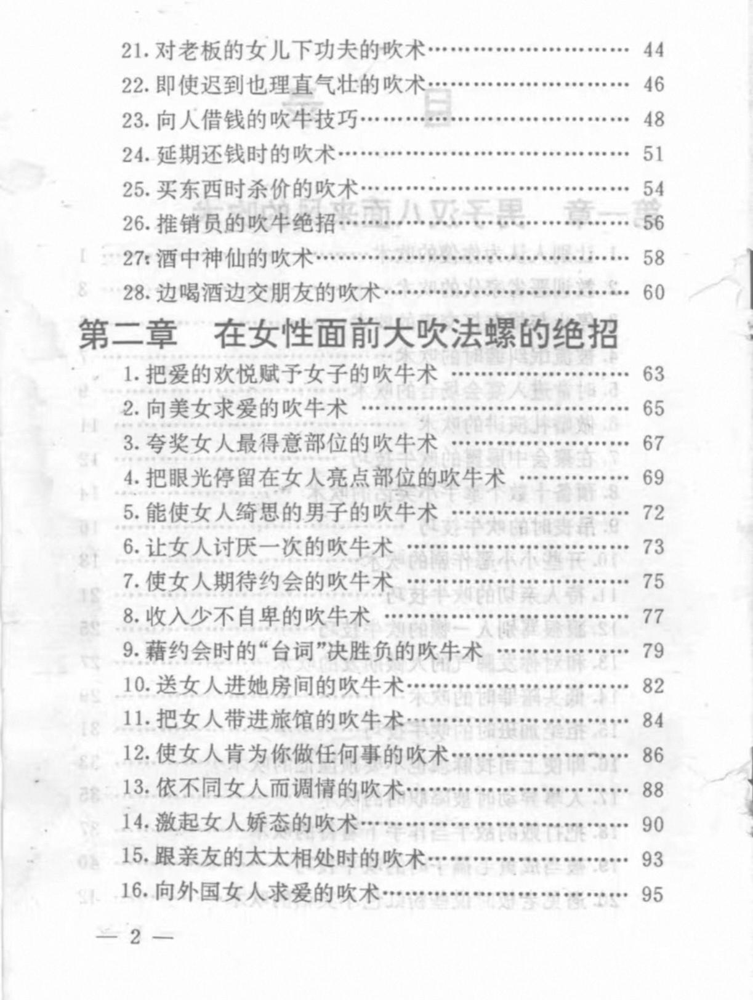
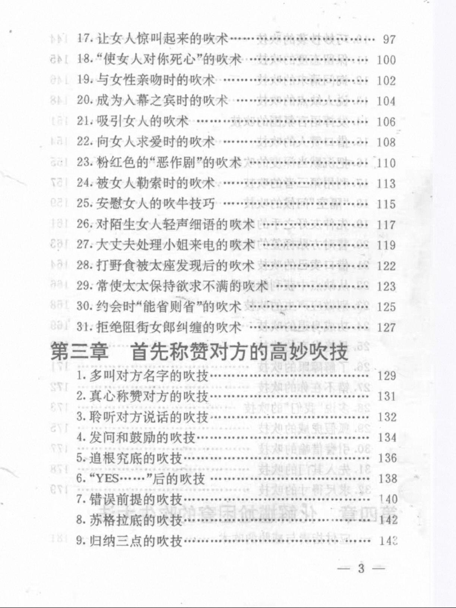
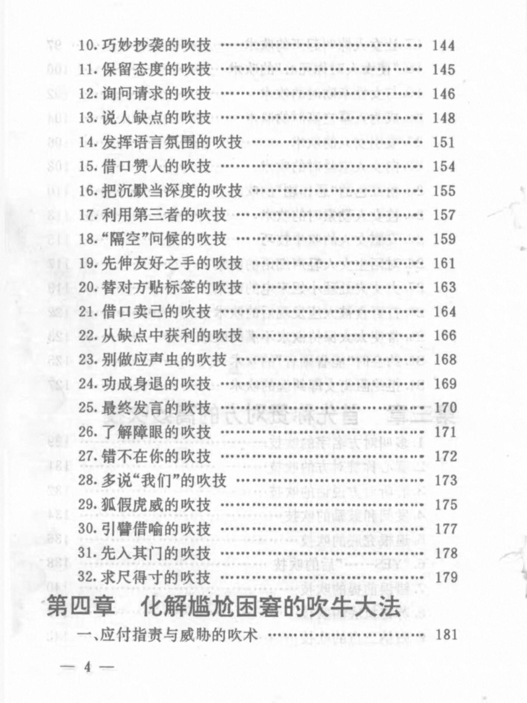

[toc]

# 问题

提问者：**<a href="https://www.zhihu.com/people/wang-shi-sui-feng-sui">往事随风碎</a>**
提问时间: 2022-4-29 10:4:20

就是很实用，很厉害，让人学到干货的那种

# 回答

回答者： **<a href="https://www.zhihu.com/people/han-guang-rui-qi">寒光</a>**
回答时间: 2025-11-11 11:30:37
点赞总数: 446
评论总数: 60
收藏总数: 799
喜欢总数：13

这本够不够硬核。

  

  

  

  

  

原文地址：[(寒光)你看过最硬核的书是哪本？](https://www.zhihu.com/question/530589216/answer/1971540300083238203) 

